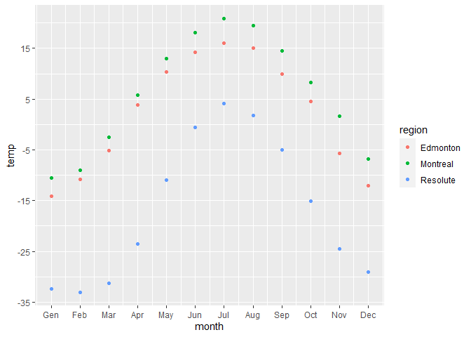
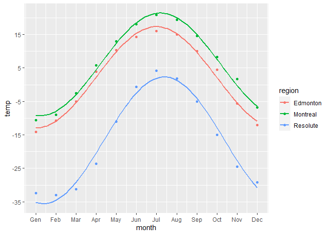
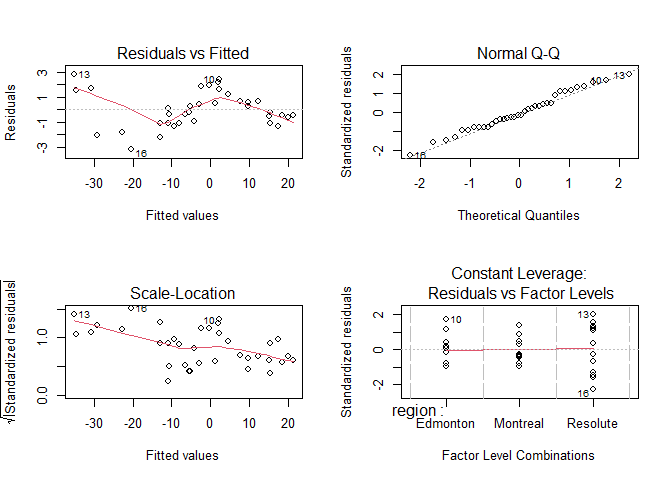
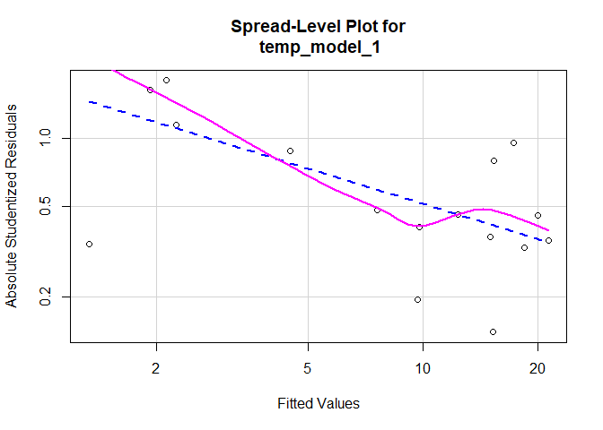
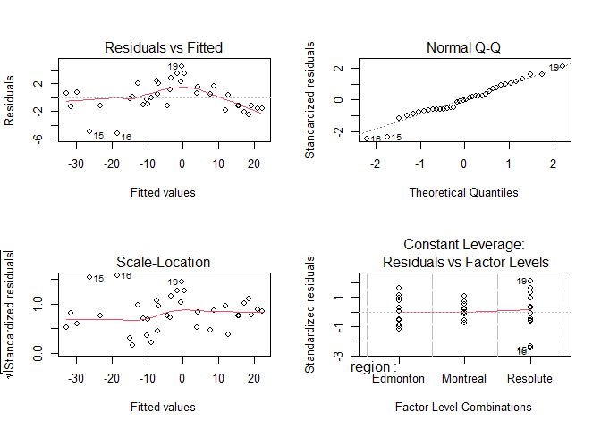
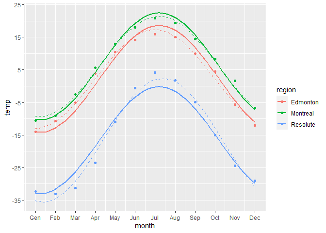

Canadian cities temperatures 🌡
================


## Table of contents

1.  [Description](#description)
2.  [Data](#data) <br> 2.1. [Data reading](#data-reading) <br> 2.2.
    [Dataset transformation](#dataset-transformation) <br> 2.3. [Data
    visualization](#data-visualization)
3.  [Model](#model) <br> 3.1. [Coefficients
    estimation](#coefficients-estimation) <br> 3.2. [Model
    visualization](#model-visualization) <br> 3.3. [Regression
    Diagnostics](#regression-diagnostics) <br> 3.4. [Solving
    heteroscedasticity](#solving-heteroscedasticity) <br> 3.5. [New
    model visualization](#new-model-visualization)

## Description

The file “Pb2.txt” contains the 2006’s average monthly temperatures
measured in three canadian cities (Edmonton, Montreal and Resolute).
It’s common practice in meteorology to assume that the average monthly
temperatures fluctuates as a sinusoid around an average year value.

## Data

### Data reading

``` r
data_temp = read.table("../Datasets/Pb2.txt")
data_temp
```

    ##       Edmonton    Resolute   Montreal
    ## Gen -14.074194 -32.3741935 -10.532258
    ## Feb -10.800000 -33.0071429  -9.057143
    ## Mar  -5.080645 -31.2322581  -2.512903
    ## Apr   3.836667 -23.5566667   5.723333
    ## Mag  10.380645 -10.9774194  12.993548
    ## Giu  14.203333  -0.5833333  18.040000
    ## Lug  15.983871   4.1193548  20.829032
    ## Ago  15.058065   1.8096774  19.416129
    ## Set   9.970000  -4.9833333  14.516667
    ## Ott   4.522581 -15.0483871   8.283871
    ## Nov  -5.663333 -24.4533333   1.663333
    ## Dic -12.083871 -29.1258065  -6.767742

### Dataset transformation

We have to transform our dataset in order to make it more suitable for
the following steps.

``` r
months <- rep(1:12, 3) #creates the new months column
regions <- factor(rep(names(data_temp), each=12)) #creates the new sites column
temps <- c(data_temp$Edmonton, data_temp$Resolute, data_temp$Montreal)
new_data_temp = data.frame(month = months, region = regions, temp = temps)

head(new_data_temp)
```

    ##   month   region       temp
    ## 1     1 Edmonton -14.074194
    ## 2     2 Edmonton -10.800000
    ## 3     3 Edmonton  -5.080645
    ## 4     4 Edmonton   3.836667
    ## 5     5 Edmonton  10.380645
    ## 6     6 Edmonton  14.203333

### Data visualization

``` r
library(GGally)
```

    ## Caricamento del pacchetto richiesto: ggplot2

    ## Registered S3 method overwritten by 'GGally':
    ##   method from   
    ##   +.gg   ggplot2

``` r
ggplot(data=new_data_temp, mapping = aes(x=month, y=temp, color=region))+
  geom_point()+
  scale_y_continuous(breaks=seq(-35,25,by=10))+
  scale_x_continuous(breaks=1:12, labels = c("Gen","Feb","Mar","Apr","May","Jun","Jul","Aug","Sep","Oct","Nov","Dec"))
```

<!-- -->

## Model

$$
T_g(t)=\beta_{0g}+\beta_{1g}\cdot \sin \Big(\frac{2\pi}{12}\cdot t\Big)+\beta_{2g}\cdot \cos \Big(\frac{2\pi}{12}\cdot t\Big)+\epsilon_g
$$ Having:

- $t$ : Month number (1,2,…,12)

- $g$ : Region (Edmonton, Montreal, Resolute)

- $T_g(t)$ : Temperature of the t-month in g-region

- $\epsilon \sim N(0,2)$

### Coefficients estimation

``` r
library(rgl)

temp_model_1 = lm(temp~region+I(sin(2*pi*month/12)):region+I(cos(2*pi*month/12)):region,data=new_data_temp) #create model
#Create table with beta coefficients estimates for each country to better visualize the correspondence with the formula.
cf = coef(temp_model_1)
beta_intercepts = c(cf[1], cf[1]+cf[2], cf[1]+cf[3])
beta_1 = c(cf[4],cf[5], cf[6])
beta_2 = c(cf[7],cf[8],cf[9])
coef_table = data.frame(beta_intercepts, beta_1, beta_2)
row.names(coef_table) = c("Edmonton", "Montreal", "Resolute")
coef_table
```

    ##          beta_intercepts     beta_1    beta_2
    ## Edmonton        2.187760  -7.507575 -13.13314
    ## Montreal        6.049656  -8.986862 -12.45601
    ## Resolute      -16.617737 -12.546397 -14.16193

### Model visualization

``` r
new_data_temp$y_hat = predict(temp_model_1, newdata = new_data_temp[,-3])

ggplot(data=new_data_temp, mapping = aes(x=month, y=temp, color=region))+
  geom_point()+
  scale_x_continuous(breaks=1:12, labels = c("Gen","Feb","Mar","Apr","May","Jun","Jul","Aug","Sep","Oct","Nov","Dec"))+
  scale_y_continuous(breaks=seq(-35,35,by=10))+
  stat_smooth(method='lm', aes(x=month, y=y_hat), formula = y ~ poly(x,11), se=FALSE)
```

<!-- -->

### Regression Diagnostics

``` r
summary(temp_model_1) #summary with diagnostical information about the model and coefficients esteems
```

    ## 
    ## Call:
    ## lm(formula = temp ~ region + I(sin(2 * pi * month/12)):region + 
    ##     I(cos(2 * pi * month/12)):region, data = new_data_temp)
    ## 
    ## Residuals:
    ##     Min      1Q  Median      3Q     Max 
    ## -3.1544 -1.1014 -0.2146  0.8167  2.7813 
    ## 
    ## Coefficients:
    ##                                          Estimate Std. Error t value Pr(>|t|)
    ## (Intercept)                                2.1878     0.4641   4.714 6.57e-05
    ## regionMontreal                             3.8619     0.6563   5.884 2.87e-06
    ## regionResolute                           -18.8055     0.6563 -28.653  < 2e-16
    ## regionEdmonton:I(sin(2 * pi * month/12))  -7.5076     0.6563 -11.439 7.36e-12
    ## regionMontreal:I(sin(2 * pi * month/12))  -8.9869     0.6563 -13.693 1.14e-13
    ## regionResolute:I(sin(2 * pi * month/12)) -12.5464     0.6563 -19.116  < 2e-16
    ## regionEdmonton:I(cos(2 * pi * month/12)) -13.1331     0.6563 -20.010  < 2e-16
    ## regionMontreal:I(cos(2 * pi * month/12)) -12.4560     0.6563 -18.978  < 2e-16
    ## regionResolute:I(cos(2 * pi * month/12)) -14.1619     0.6563 -21.578  < 2e-16
    ##                                             
    ## (Intercept)                              ***
    ## regionMontreal                           ***
    ## regionResolute                           ***
    ## regionEdmonton:I(sin(2 * pi * month/12)) ***
    ## regionMontreal:I(sin(2 * pi * month/12)) ***
    ## regionResolute:I(sin(2 * pi * month/12)) ***
    ## regionEdmonton:I(cos(2 * pi * month/12)) ***
    ## regionMontreal:I(cos(2 * pi * month/12)) ***
    ## regionResolute:I(cos(2 * pi * month/12)) ***
    ## ---
    ## Signif. codes:  0 '***' 0.001 '**' 0.01 '*' 0.05 '.' 0.1 ' ' 1
    ## 
    ## Residual standard error: 1.608 on 27 degrees of freedom
    ## Multiple R-squared:  0.9918, Adjusted R-squared:  0.9894 
    ## F-statistic: 409.4 on 8 and 27 DF,  p-value: < 2.2e-16

✅ R-Squared index is high and all the introduced variables have high
significance (low P-Values for the null hypotesis beta=0).

``` r
shapiro.test(temp_model_1$residuals)
```

    ## 
    ##  Shapiro-Wilk normality test
    ## 
    ## data:  temp_model_1$residuals
    ## W = 0.98244, p-value = 0.8243

✅ The Shapiro-Wilk normality test has high P-Value so we can accept
$H_0$ (residuals are normally-distributed) and confirm the model
assumption we made at the beginning.

``` r
par(mfrow=c(2,2))
plot(temp_model_1)
```

<!-- -->

``` r
library(car)
```

⚠️ From the first graph it seems that there could be some other
sinusoidal relations between the variate and the covariates. Also the
graph below highlights a decrease in residuals variance at higher fitted
values.

We might have a problem of heteroscedasticity. Let’s investigate.

``` r
library(car)
spreadLevelPlot(temp_model_1)
```

    ## Warning in spreadLevelPlot.lm(temp_model_1): 
    ## 20 negative fitted values removed

<!-- -->

    ## 
    ## Suggested power transformation:  1.513364

``` r
ncvTest(temp_model_1)
```

    ## Non-constant Variance Score Test 
    ## Variance formula: ~ fitted.values 
    ## Chisquare = 6.966896, Df = 1, p = 0.0083031

❌ The Non-constant Variance Score Test returns a P-Value of 0.0083 that
means that we have to reject the null hypotesis of costant variance.

This represents a violation of the core assumptions of OLS regression.

### Solving heteroscedasticity

💡 We can try to remove the interactions between month and region
variables

``` r
library(rgl)

temp_model_2 = lm(temp~region+I(sin(2*pi*month/12))+I(cos(2*pi*month/12)),data=new_data_temp)
summary(temp_model_2)
```

    ## 
    ## Call:
    ## lm(formula = temp ~ region + I(sin(2 * pi * month/12)) + I(cos(2 * 
    ##     pi * month/12)), data = new_data_temp)
    ## 
    ## Residuals:
    ##     Min      1Q  Median      3Q     Max 
    ## -5.1807 -1.2411 -0.0225  1.4634  4.4218 
    ## 
    ## Coefficients:
    ##                           Estimate Std. Error t value Pr(>|t|)    
    ## (Intercept)                  2.188      0.654   3.345 0.002165 ** 
    ## regionMontreal               3.862      0.925   4.175 0.000224 ***
    ## regionResolute             -18.805      0.925 -20.331  < 2e-16 ***
    ## I(sin(2 * pi * month/12))   -9.680      0.534 -18.127  < 2e-16 ***
    ## I(cos(2 * pi * month/12))  -13.250      0.534 -24.812  < 2e-16 ***
    ## ---
    ## Signif. codes:  0 '***' 0.001 '**' 0.01 '*' 0.05 '.' 0.1 ' ' 1
    ## 
    ## Residual standard error: 2.266 on 31 degrees of freedom
    ## Multiple R-squared:  0.9814, Adjusted R-squared:  0.979 
    ## F-statistic: 407.9 on 4 and 31 DF,  p-value: < 2.2e-16

The summary shows high statistical significance for every predictor and
$R^2$ index is still very high.

The new estimated coefficients are:

``` r
#Create table with beta coefficients estimates for each country to better visualize the correspondence with the formula.
cf2 = coef(temp_model_2)
beta_intercepts = c(cf2[1], cf2[1]+cf2[2], cf2[1]+cf2[3])
beta_1 = rep(cf2[4],3)
beta_2 = rep(cf2[5],3)
coef_table = data.frame(beta_intercepts, beta_1, beta_2)
row.names(coef_table) = c("Edmonton", "Montreal", "Resolute")
coef_table
```

    ##          beta_intercepts    beta_1    beta_2
    ## Edmonton        2.187760 -9.680278 -13.25036
    ## Montreal        6.049656 -9.680278 -13.25036
    ## Resolute      -16.617737 -9.680278 -13.25036

Now we can see if heteroscedasticity has been solved

``` r
par(mfrow=c(2,2))
plot(temp_model_2)
```

<!-- -->

``` r
ncvTest(temp_model_2)
```

    ## Non-constant Variance Score Test 
    ## Variance formula: ~ fitted.values 
    ## Chisquare = 0.9437596, Df = 1, p = 0.33131

``` r
outlierTest(temp_model_1)
```

    ## No Studentized residuals with Bonferroni p < 0.05
    ## Largest |rstudent|:
    ##     rstudent unadjusted p-value Bonferroni p
    ## 16 -2.470502            0.02037      0.73331

- ✅ Residuals vs Fitted values doesn’t show particular patterns =\> We
  have correctly included the non linear relations between the
  covariates and the response variable.

- ✅ The linearity of residuals in the Q-Q Plot tell us that they are
  normally distributed.

- ✅ The horizontal line in Scale-Location graph and the high P-Value of
  NCV Test indicates that heteroscedasticity has been solved

- ✅ There are no leverage points in the bottom right graph.

- ✅ Bonferroni’s test and the graphs doesn’t show any outlier.

All the model’s assumptions are respected.

### New model visualization

``` r
new_data_temp$y_hat2 = predict(temp_model_2, newdata = new_data_temp[,-3])

ggplot(data=new_data_temp, mapping = aes(x=month, y=temp, color=region))+
  geom_point()+
  scale_x_continuous(breaks=1:12, labels = c("Gen","Feb","Mar","Apr","May","Jun","Jul","Aug","Sep","Oct","Nov","Dec"))+
  scale_y_continuous(breaks=seq(-35,35,by=10))+
  stat_smooth(method='lm', aes(x=month, y=y_hat2), formula = y ~ poly(x,11), se=FALSE)+
  stat_smooth(method='lm', aes(x=month, y=y_hat ), linetype="dashed", linewidth=.5, formula = y ~ poly(x,11), se=FALSE)
```

<!-- -->

## Model reformulation

$$
T_g(t)=\beta_{0g}+\beta_{1g}\cdot \sin \Big(\frac{2\pi}{12}\cdot t\Big)+\beta_{2g}\cdot \cos \Big(\frac{2\pi}{12}\cdot t\Big)+\epsilon_g
$$

Using the identity

$$
\sin (\alpha-\beta)=\sin (\alpha)\cdot\cos(\beta)-\cos(\alpha)\cdot \sin(\beta)
$$

The model can be reformulated as following:

$$
T_g(t)=\mu_g+A_g\cdot \sin \Big (\frac{2\pi}{12}\cdot(t-\phi_g)\Big )+\epsilon_g
$$

### New coefficients

$$
\mu_g=\beta_{0g}
$$

$$
A_g=\sqrt{\beta_{1g}^2+\beta_{2g}^2}
$$

$$
\phi_g=\frac{6}{\pi}\arctan\Big(-\frac{\beta_{2g}}{\beta_{1g}}\Big )
$$

``` r
mu_g = beta_intercepts
A_g=sqrt(beta_1^2+beta_2^2)
phi_g=(6/pi)*atan(-beta_2/beta_1)
coef_table = data.frame(mu_g, A_g, phi_g)
row.names(coef_table) = c("Edmonton", "Montreal", "Resolute")
coef_table
```

    ##                mu_g      A_g     phi_g
    ## Edmonton   2.187760 16.40975 -1.794979
    ## Montreal   6.049656 16.40975 -1.794979
    ## Resolute -16.617737 16.40975 -1.794979
