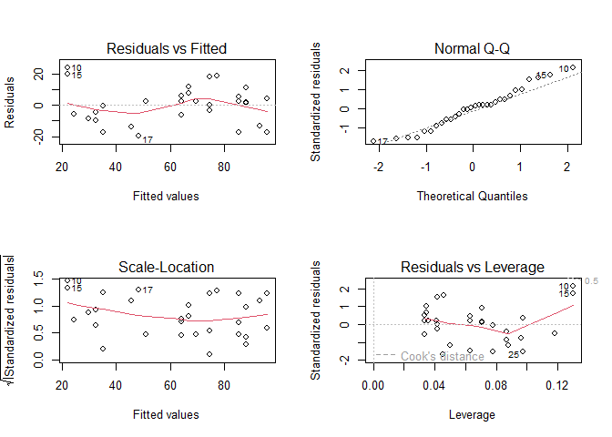
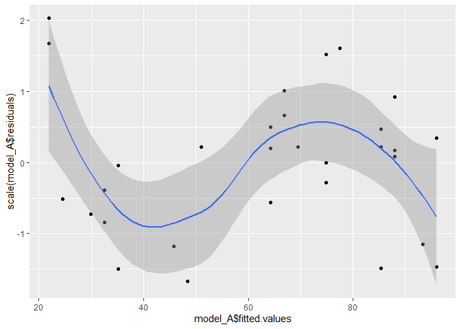
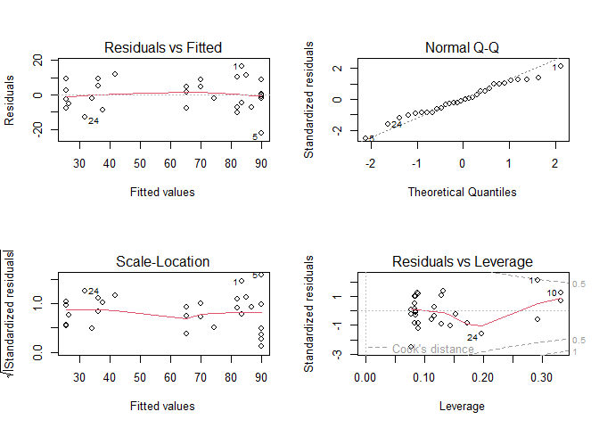
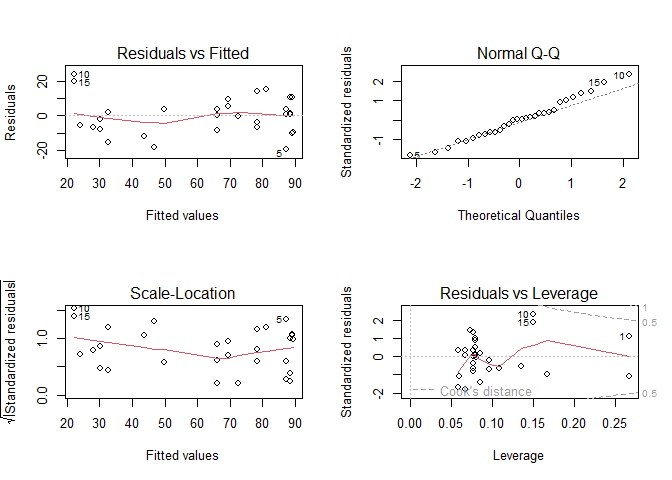
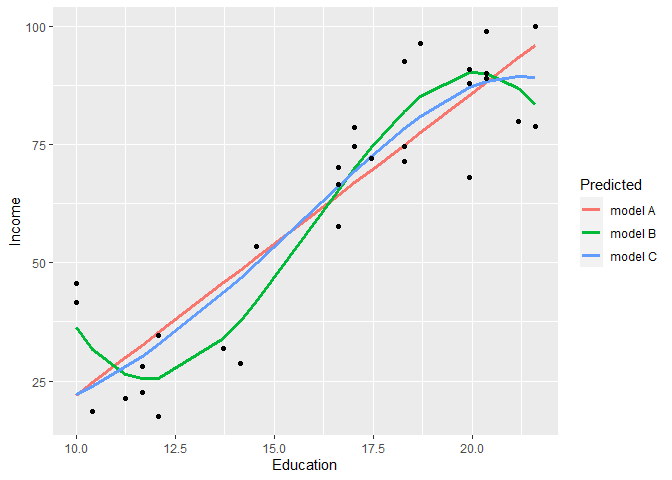

Education
================


Simple linear regression exercise con education - income dataset
“Income2.csv”

## Data loading

``` r
#importing libraries
library(GGally)
library(MASS)
library(car)
library(rgl)
#loading data
data = read.csv(file = "../Datasets/Income2.csv", header = T)
```

## Model A

``` r
model_A = lm(Income ~ Education, data = data)
summary(model_A)
```

    ## 
    ## Call:
    ## lm(formula = Income ~ Education, data = data)
    ## 
    ## Residuals:
    ##     Min      1Q  Median      3Q     Max 
    ## -19.568  -8.012   1.474   5.754  23.701 
    ## 
    ## Coefficients:
    ##             Estimate Std. Error t value Pr(>|t|)    
    ## (Intercept) -41.9166     9.7689  -4.291 0.000192 ***
    ## Education     6.3872     0.5812  10.990 1.15e-11 ***
    ## ---
    ## Signif. codes:  0 '***' 0.001 '**' 0.01 '*' 0.05 '.' 0.1 ' ' 1
    ## 
    ## Residual standard error: 11.93 on 28 degrees of freedom
    ## Multiple R-squared:  0.8118, Adjusted R-squared:  0.8051 
    ## F-statistic: 120.8 on 1 and 28 DF,  p-value: 1.151e-11

The model seems good: high R^2 index and statistically significant
parameters.

Let’s do some diagnostics

``` r
par(mfrow=c(2,2))
plot(model_A)
```

<!-- -->

The model seems very good: good homoscedacity and good distribution of
points in the Q-Q Plot along the diagonal, no leverage points…

I want to further investigate the Residual vs Fitted plot though

``` r
ggplot(data, aes(x=model_A$fitted.values, y=scale(model_A$residuals)))+
  geom_point()+
  geom_smooth(method = "loess", formula="y~x")
```

<!-- -->

This pattern seems a little bit suspicious to me. I’ll define another
model.

## Model B

``` r
model_B = lm(Income ~ Education+I(Education^2)+I(Education^3), data = data)
summary(model_B)
```

    ## 
    ## Call:
    ## lm(formula = Income ~ Education + I(Education^2) + I(Education^3), 
    ##     data = data)
    ## 
    ## Residuals:
    ##      Min       1Q   Median       3Q      Max 
    ## -22.1594  -6.5919  -0.6362   7.8437  16.3670 
    ## 
    ## Coefficients:
    ##                  Estimate Std. Error t value Pr(>|t|)    
    ## (Intercept)     797.13366  185.14002   4.306 0.000210 ***
    ## Education      -162.26949   36.88138  -4.400 0.000164 ***
    ## I(Education^2)   10.88980    2.37058   4.594 9.82e-05 ***
    ## I(Education^3)   -0.22718    0.04944  -4.595 9.79e-05 ***
    ## ---
    ## Signif. codes:  0 '***' 0.001 '**' 0.01 '*' 0.05 '.' 0.1 ' ' 1
    ## 
    ## Residual standard error: 9.192 on 26 degrees of freedom
    ## Multiple R-squared:  0.8962, Adjusted R-squared:  0.8842 
    ## F-statistic: 74.81 on 3 and 26 DF,  p-value: 6.476e-13

R^2 has increased. Predictors are all statistically significative. This
model seems to be better than the previous one.

``` r
par(mfrow=c(2,2))
plot(model_B)
```

<!-- -->

``` r
shapiro.test(model_B$residuals)
```

    ## 
    ##  Shapiro-Wilk normality test
    ## 
    ## data:  model_B$residuals
    ## W = 0.97704, p-value = 0.7426

Much better, but I see that point 1 is almost a leverage point.

## Model C

I’ll try to create something like a smoothstep

``` r
model_C = lm(Income ~ I(Education^4)+I(Education^5), data = data)
summary(model_C)
```

    ## 
    ## Call:
    ## lm(formula = Income ~ I(Education^4) + I(Education^5), data = data)
    ## 
    ## Residuals:
    ##      Min       1Q   Median       3Q      Max 
    ## -19.1115  -7.4209   0.5088   4.9018  23.5794 
    ## 
    ## Coefficients:
    ##                  Estimate Std. Error t value Pr(>|t|)    
    ## (Intercept)     9.683e+00  6.018e+00   1.609 0.119264    
    ## I(Education^4)  1.993e-03  3.916e-04   5.089  2.4e-05 ***
    ## I(Education^5) -7.538e-05  1.785e-05  -4.222 0.000245 ***
    ## ---
    ## Signif. codes:  0 '***' 0.001 '**' 0.01 '*' 0.05 '.' 0.1 ' ' 1
    ## 
    ## Residual standard error: 11.02 on 27 degrees of freedom
    ## Multiple R-squared:  0.845,  Adjusted R-squared:  0.8335 
    ## F-statistic:  73.6 on 2 and 27 DF,  p-value: 1.173e-11

R^2 slightly decreased but it’s better than model A and the rest is
still good.

``` r
par(mfrow=c(2,2))
plot(model_C)
```

<!-- -->

Point 1 is no more on the Cook’s distance curve. Better.

Pattern in residuals vs fitted is again visible.

## Conclusion

``` r
data$model_A_inc <- predict(model_A, data.frame(Education=data$Education))
data$model_B_inc <- predict(model_B, data.frame(Education=data$Education))
data$model_C_inc <- predict(model_C, data.frame(Education=data$Education))
df <- data.frame(Education=rep(data$Education,3), Income=data$Income,Prediction=c(data$model_A_inc,data$model_B_inc,data$model_C_inc), Predicted=c(rep("model A",30),rep("model B",30),rep("model C",30)))
ggplot(df, aes(x=Education, y=Prediction, color=Predicted))+
  geom_line(size=1.2)+
  geom_point(aes(x=Education, y=Income), color="black")+
  ylab("Income")
```

    ## Warning: Using `size` aesthetic for lines was deprecated in ggplot2 3.4.0.
    ## ℹ Please use `linewidth` instead.
    ## This warning is displayed once every 8 hours.
    ## Call `lifecycle::last_lifecycle_warnings()` to see where this warning was
    ## generated.

<!-- -->

Model B and C seems much better than model A: there seem to be a
diminishing marginal return between education and income. If you get
moderately educated, you will obtain great improvements in terms of
future income but, if you keep studying, you won’t receive as much
improvements as you got before.
