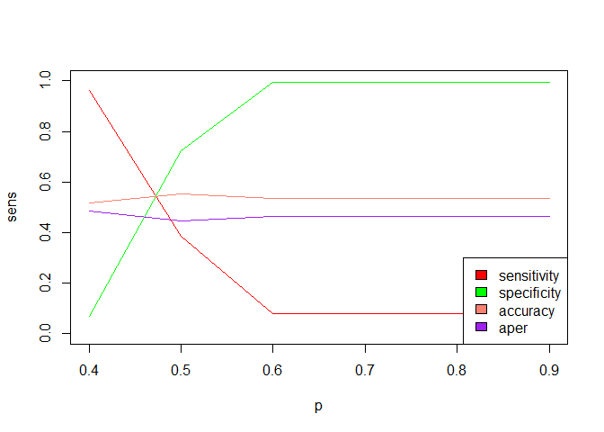
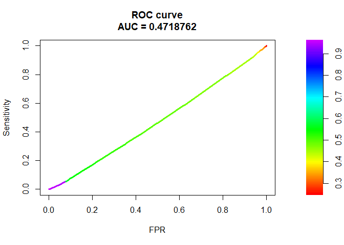

Esame 2023-02-13
================

# Parte B

## Data loading

``` r
data <- read.csv("../Datasets/ricavi.csv", fileEncoding = "utf8")
head(data)
```

    ##        ricavi ricavi_alti weekend pioggia natale estate      staff    clienti
    ## 1  3.26323319           0       0       1      0      0 -0.5029797  1.4269726
    ## 2  3.84909336           0       0       1      0      0 -0.1701255  1.5708433
    ## 3  3.38510076           0       0       0      0      0  0.4955830  1.5132950
    ## 4  1.92540199           0       0       0      0      0  0.4955830  1.6715528
    ## 5 -0.02901392           1       0       0      0      0  0.1627287 -1.3641191
    ## 6  0.80569962           1       0       1      0      0 -0.5029797  0.1896845
    ##      under30   famiglie trattamento
    ## 1  2.2028748  0.7946287           0
    ## 2  0.8042241  2.1187328           0
    ## 3  2.2028748  2.1469052           0
    ## 4 -0.3569198  0.6819390           0
    ## 5 -1.2277778 -1.2901308           0
    ## 6  0.1180936  0.5692493           0

``` r
str(data)
```

    ## 'data.frame':    2880 obs. of  11 variables:
    ##  $ ricavi     : num  3.263 3.849 3.385 1.925 -0.029 ...
    ##  $ ricavi_alti: int  0 0 0 0 1 1 0 0 0 0 ...
    ##  $ weekend    : int  0 0 0 0 0 0 0 0 0 0 ...
    ##  $ pioggia    : int  1 1 0 0 0 1 1 1 1 0 ...
    ##  $ natale     : int  0 0 0 0 0 0 0 0 0 0 ...
    ##  $ estate     : int  0 0 0 0 0 0 0 0 0 0 ...
    ##  $ staff      : num  -0.503 -0.17 0.496 0.496 0.163 ...
    ##  $ clienti    : num  1.43 1.57 1.51 1.67 -1.36 ...
    ##  $ under30    : num  2.203 0.804 2.203 -0.357 -1.228 ...
    ##  $ famiglie   : num  0.795 2.119 2.147 0.682 -1.29 ...
    ##  $ trattamento: int  0 0 0 0 0 0 1 1 0 0 ...

``` r
j=1
for (i in data){
  if(typeof(i)=="integer"){
      data[,j] <- factor(i)
  }
  j=j+1
}
str(data)
```

    ## 'data.frame':    2880 obs. of  11 variables:
    ##  $ ricavi     : num  3.263 3.849 3.385 1.925 -0.029 ...
    ##  $ ricavi_alti: Factor w/ 2 levels "0","1": 1 1 1 1 2 2 1 1 1 1 ...
    ##  $ weekend    : Factor w/ 2 levels "0","1": 1 1 1 1 1 1 1 1 1 1 ...
    ##  $ pioggia    : Factor w/ 2 levels "0","1": 2 2 1 1 1 2 2 2 2 1 ...
    ##  $ natale     : Factor w/ 2 levels "0","1": 1 1 1 1 1 1 1 1 1 1 ...
    ##  $ estate     : Factor w/ 2 levels "0","1": 1 1 1 1 1 1 1 1 1 1 ...
    ##  $ staff      : num  -0.503 -0.17 0.496 0.496 0.163 ...
    ##  $ clienti    : num  1.43 1.57 1.51 1.67 -1.36 ...
    ##  $ under30    : num  2.203 0.804 2.203 -0.357 -1.228 ...
    ##  $ famiglie   : num  0.795 2.119 2.147 0.682 -1.29 ...
    ##  $ trattamento: Factor w/ 2 levels "0","1": 1 1 1 1 1 1 2 2 1 1 ...

## Domanda 1

``` r
library(GGally)
library(MASS)
library(car)
library(rgl)
first_model = lm(ricavi ~ .-ricavi_alti, data = data)
first_model$coefficients
```

    ##  (Intercept)     weekend1     pioggia1      natale1      estate1        staff 
    ##   0.96920965   0.35975155  -0.20265181   0.38850734  -0.19719319   0.07609166 
    ##      clienti      under30     famiglie trattamento1 
    ##   0.57639886   0.22069752   0.40208112   0.93866913

``` r
summary(first_model)
```

    ## 
    ## Call:
    ## lm(formula = ricavi ~ . - ricavi_alti, data = data)
    ## 
    ## Residuals:
    ##     Min      1Q  Median      3Q     Max 
    ## -3.1914 -0.6946  0.0211  0.7037  2.9954 
    ## 
    ## Coefficients:
    ##              Estimate Std. Error t value Pr(>|t|)    
    ## (Intercept)   0.96921    0.03949  24.544  < 2e-16 ***
    ## weekend1      0.35975    0.04526   7.949 2.68e-15 ***
    ## pioggia1     -0.20265    0.06455  -3.139 0.001710 ** 
    ## natale1       0.38851    0.10059   3.862 0.000115 ***
    ## estate1      -0.19719    0.18431  -1.070 0.284756    
    ## staff         0.07609    0.05169   1.472 0.141143    
    ## clienti       0.57640    0.05360  10.755  < 2e-16 ***
    ## under30       0.22070    0.04844   4.556 5.43e-06 ***
    ## famiglie      0.40208    0.03080  13.055  < 2e-16 ***
    ## trattamento1  0.93867    0.06053  15.508  < 2e-16 ***
    ## ---
    ## Signif. codes:  0 '***' 0.001 '**' 0.01 '*' 0.05 '.' 0.1 ' ' 1
    ## 
    ## Residual standard error: 1.015 on 2870 degrees of freedom
    ## Multiple R-squared:  0.5541, Adjusted R-squared:  0.5527 
    ## F-statistic: 396.2 on 9 and 2870 DF,  p-value: < 2.2e-16

## Domanda 2

``` r
summary(first_model)
```

    ## 
    ## Call:
    ## lm(formula = ricavi ~ . - ricavi_alti, data = data)
    ## 
    ## Residuals:
    ##     Min      1Q  Median      3Q     Max 
    ## -3.1914 -0.6946  0.0211  0.7037  2.9954 
    ## 
    ## Coefficients:
    ##              Estimate Std. Error t value Pr(>|t|)    
    ## (Intercept)   0.96921    0.03949  24.544  < 2e-16 ***
    ## weekend1      0.35975    0.04526   7.949 2.68e-15 ***
    ## pioggia1     -0.20265    0.06455  -3.139 0.001710 ** 
    ## natale1       0.38851    0.10059   3.862 0.000115 ***
    ## estate1      -0.19719    0.18431  -1.070 0.284756    
    ## staff         0.07609    0.05169   1.472 0.141143    
    ## clienti       0.57640    0.05360  10.755  < 2e-16 ***
    ## under30       0.22070    0.04844   4.556 5.43e-06 ***
    ## famiglie      0.40208    0.03080  13.055  < 2e-16 ***
    ## trattamento1  0.93867    0.06053  15.508  < 2e-16 ***
    ## ---
    ## Signif. codes:  0 '***' 0.001 '**' 0.01 '*' 0.05 '.' 0.1 ' ' 1
    ## 
    ## Residual standard error: 1.015 on 2870 degrees of freedom
    ## Multiple R-squared:  0.5541, Adjusted R-squared:  0.5527 
    ## F-statistic: 396.2 on 9 and 2870 DF,  p-value: < 2.2e-16

``` r
varianza_spiegata=0.5541
aumento_ricavi = 3*coef(first_model)[9]
aumento_ricavi
```

    ## famiglie 
    ## 1.206243

## Domanda 3

I giorni promozionali (variabile trattamento=1) non sono stati scelti in
maniera casuale e c’è il sospetto che non siano comparabili col campione
dei giorni in cui la promozione non è avvenuta (variabile
trattamento=0).

Si utilizzi la tecnica del propensity score matching per identificare un
gruppo di giornate di vendita senza promozione speciale (i.e., un gruppo
di giornate non trattate) comparabile con le giornate promozionali.

Si utilizzino le covariate staff, under30, weekend, ed il metodo di
distance nearest per effettuare il matching.

Si calcoli lo stimatore ingenuo dell’effetto della promozione sui
ricavi, prima e dopo il matching. Individuare

le risposte corrette tra le seguenti:

- Lo stimatore ingenuo prima del matching è maggiore dell’effetto della
  variabile trattamento nell’esercizio precedente FALSO

- Lo stimatore ingenuo dopo il matching è maggiore dell’effetto della
  variabile trattamento nell’esercizio precedente FALSO

- Lo stimatore ingenuo dopo il matching è maggiore dello stimatore
  ingenuo prima del matching VERO

- Lo stimatore ingenuo dopo il matching è maggiore o uguale a 0.6657
  VERO

``` r
library(knitr)
library(corrplot)
```

    ## corrplot 0.92 loaded

``` r
library(ggplot2)
library(sjPlot)
```

    ## Learn more about sjPlot with 'browseVignettes("sjPlot")'.

``` r
library(stargazer)
```

    ## 
    ## Please cite as:

    ##  Hlavac, Marek (2022). stargazer: Well-Formatted Regression and Summary Statistics Tables.

    ##  R package version 5.2.3. https://CRAN.R-project.org/package=stargazer

``` r
library(MatchIt)
library(MASS)
library(mvtnorm)
library(ivreg)
library(rdrobust)

data_non_trattati <- data[data$trattamento==0,]
data_trattati <- data[data$trattamento==1,]

#verifico se sono effettivamente diversi

#t-test H0: differenza tra gruppi = a 0
#t-test H1: differenza tra gruppi diversa da 0
#p-value ALTO => BENE: Gruppi confrontabili
#p-value BASSO => MALE: Le medie dei due gruppi sono diverse, non sono confrontabili


cat("--------------------------------------------------\n PRE MATCHING \n --------------------------------------------------\n")
```

    ## --------------------------------------------------
    ##  PRE MATCHING 
    ##  --------------------------------------------------

``` r
t.test(data_non_trattati$staff, data_trattati$staff) #MALE
```

    ## 
    ##  Welch Two Sample t-test
    ## 
    ## data:  data_non_trattati$staff and data_trattati$staff
    ## t = 32.171, df = 879.15, p-value < 2.2e-16
    ## alternative hypothesis: true difference in means is not equal to 0
    ## 95 percent confidence interval:
    ##  1.365457 1.542885
    ## sample estimates:
    ## mean of x mean of y 
    ##  0.405956 -1.048215

``` r
t.test(data_non_trattati$clienti, data_trattati$clienti) #MALE
```

    ## 
    ##  Welch Two Sample t-test
    ## 
    ## data:  data_non_trattati$clienti and data_trattati$clienti
    ## t = 8.2682, df = 1504.4, p-value = 2.956e-16
    ## alternative hypothesis: true difference in means is not equal to 0
    ## 95 percent confidence interval:
    ##  0.2553552 0.4142009
    ## sample estimates:
    ##   mean of x   mean of y 
    ##  0.09345887 -0.24131917

``` r
t.test(data_non_trattati$under30, data_trattati$under30) #MALE
```

    ## 
    ##  Welch Two Sample t-test
    ## 
    ## data:  data_non_trattati$under30 and data_trattati$under30
    ## t = 9.1943, df = 1581.1, p-value < 2.2e-16
    ## alternative hypothesis: true difference in means is not equal to 0
    ## 95 percent confidence interval:
    ##  0.2855289 0.4403944
    ## sample estimates:
    ##  mean of x  mean of y 
    ##  0.1013268 -0.2616348

``` r
t.test(data_non_trattati$famiglie, data_trattati$famiglie) #MALE
```

    ## 
    ##  Welch Two Sample t-test
    ## 
    ## data:  data_non_trattati$famiglie and data_trattati$famiglie
    ## t = 6.3023, df = 1576.4, p-value = 3.798e-10
    ## alternative hypothesis: true difference in means is not equal to 0
    ## 95 percent confidence interval:
    ##  0.1728136 0.3289919
    ## sample estimates:
    ##   mean of x   mean of y 
    ##  0.07004368 -0.18085906

``` r
cat("--------------------------------------------------\n")
```

    ## --------------------------------------------------

``` r
#Naive estimator pre matching
naive_estimator_pre = mean(data_trattati$ricavi) - mean(data_non_trattati$ricavi)
cat("naive_estimator pre matching",naive_estimator_pre,'\n')
```

    ## naive_estimator pre matching 0.2321186

``` r
cat("--------------------------------------------------\n")
```

    ## --------------------------------------------------

``` r
#MATCHING

psm_result = matchit(
  data$trattamento ~ data$staff + data$under30 + data$weekend, 
  method = "nearest")
data_post_psm = match.data(psm_result, data=data)
data_post_psm_trattati = data_post_psm[data_post_psm$trattamento==1,]
data_post_psm_non_trattati = data_post_psm[data_post_psm$trattamento==0,]

cat("--------------------------------------------------\n POST MATCHING \n --------------------------------------------------\n")
```

    ## --------------------------------------------------
    ##  POST MATCHING 
    ##  --------------------------------------------------

``` r
t.test(data_post_psm_trattati$staff, data_post_psm_non_trattati$staff)# MALE
```

    ## 
    ##  Welch Two Sample t-test
    ## 
    ## data:  data_post_psm_trattati$staff and data_post_psm_non_trattati$staff
    ## t = -23.539, df = 936.56, p-value < 2.2e-16
    ## alternative hypothesis: true difference in means is not equal to 0
    ## 95 percent confidence interval:
    ##  -1.172864 -0.992345
    ## sample estimates:
    ##   mean of x   mean of y 
    ## -1.04821484  0.03438942

``` r
t.test(data_post_psm_trattati$clienti, data_post_psm_non_trattati$clienti)#OK
```

    ## 
    ##  Welch Two Sample t-test
    ## 
    ## data:  data_post_psm_trattati$clienti and data_post_psm_non_trattati$clienti
    ## t = -0.57264, df = 1606, p-value = 0.567
    ## alternative hypothesis: true difference in means is not equal to 0
    ## 95 percent confidence interval:
    ##  -0.12194912  0.06683448
    ## sample estimates:
    ##  mean of x  mean of y 
    ## -0.2413192 -0.2137618

``` r
t.test(data_post_psm_trattati$under30, data_post_psm_non_trattati$under30) #OK
```

    ## 
    ##  Welch Two Sample t-test
    ## 
    ## data:  data_post_psm_trattati$under30 and data_post_psm_non_trattati$under30
    ## t = -1.0609, df = 1605.5, p-value = 0.2889
    ## alternative hypothesis: true difference in means is not equal to 0
    ## 95 percent confidence interval:
    ##  -0.14091753  0.04198922
    ## sample estimates:
    ##  mean of x  mean of y 
    ## -0.2616348 -0.2121707

``` r
t.test(data_post_psm_trattati$famiglie, data_post_psm_non_trattati$famiglie) #OK, 0.9785
```

    ## 
    ##  Welch Two Sample t-test
    ## 
    ## data:  data_post_psm_trattati$famiglie and data_post_psm_non_trattati$famiglie
    ## t = -0.026926, df = 1605.9, p-value = 0.9785
    ## alternative hypothesis: true difference in means is not equal to 0
    ## 95 percent confidence interval:
    ##  -0.09315344  0.09063053
    ## sample estimates:
    ##  mean of x  mean of y 
    ## -0.1808591 -0.1795976

``` r
cat("--------------------------------------------------\n")
```

    ## --------------------------------------------------

``` r
#Naive estimator after matching
naive_estimator_post = mean(data_post_psm_trattati$ricavi) - mean(data_post_psm_non_trattati$ricavi)
cat("naive_estimator post matching: ",naive_estimator_post,'\n')
```

    ## naive_estimator post matching:  0.6689329

``` r
cat("--------------------------------------------------\n")
```

    ## --------------------------------------------------

## Domanda 4

Si controlli se la procedura di matching ha reso il campione dei
trattati e quello dei non trattati comparabili, tramite t-test. Si
eseguano due t-test, prima e dopo il matching, tra il campione dei
trattati e quello dei non trattati, per le variabili under30, staff e
famiglie. Si individui le risposte corrette tra le seguenti:

- Con un livello di significatività dell’1%, il t-test indica che dopo
  il matching il campione dei trattati ha una media della variabile
  ‘under30’ comparabile a quella del campione dei non trattati, mentre
  prima del matching non era così. VERO

- Con un livello di significatività dell’1%, il t-test indica che prima
  del matching il campione dei trattati aveva una media della variabile
  ‘staff’ comparabile a quella del campione dei non trattati, mentre
  dopo il matching non è così. FALSO

- Con un livello di significatività dell’1%, il t-test indica che dopo
  il matching il campione dei trattati ha una media della variabile
  ‘famiglie’ comparabile a quella del campione dei non trattati, mentre
  prima del matching non era così. VERO

- Il t-test eseguito sulla variabile ‘famiglie’ tra il campione dei
  trattati e quello dei non trattati dopo il matching riporta un p-value
  inferiore a .85 FALSO

- Tutte le altre risposte sono false FALSO

## Domanda 5

Si stimi una regressione lineare sul dataset post-matching, usando le
stesse variabili, sia dipendenti che indipendenti, del modello di cui
alla domanda 1 (nota: controllare le colonne dei dataset prima di
procedere per assicurarsi di selezionare le variabili corrette). Si
selezionino le risposte vere.

- L’effetto di trattamento stimato con il modello di questa domanda è
  più alto dell’effetto di trattamento stimato nella domanda 1 VERO

- L’effetto di trattamento stimato con il modello di questa domanda è
  più alto di quello stimato con lo stimatore ingenuo sul dataset
  post-matching VERO

- L’effetto di trattamento stimato con il modello di questa domanda è
  più alto di quello stimato con lo stimatore ingenuo sul dataset
  pre-matching VERO

- L’effetto di trattamento stimato in questa domanda è più credibile,
  vale a dire più vicino all’effetto di trattamento reale, di quello
  stimato nella domanda 1 VERO

``` r
data_post_psm$subclass=NULL
data_post_psm$distance=NULL
data_post_psm$weights=NULL

str(data_post_psm)
```

    ## Classes 'matchdata' and 'data.frame':    1608 obs. of  11 variables:
    ##  $ ricavi     : num  3.263 3.849 -0.029 0.806 2.776 ...
    ##  $ ricavi_alti: Factor w/ 2 levels "0","1": 1 1 2 2 1 1 1 2 2 1 ...
    ##  $ weekend    : Factor w/ 2 levels "0","1": 1 1 1 1 1 1 1 1 1 1 ...
    ##  $ pioggia    : Factor w/ 2 levels "0","1": 2 2 1 2 2 2 2 2 1 1 ...
    ##  $ natale     : Factor w/ 2 levels "0","1": 1 1 1 1 1 1 1 1 1 1 ...
    ##  $ estate     : Factor w/ 2 levels "0","1": 1 1 1 1 1 1 1 1 1 1 ...
    ##  $ staff      : num  -0.503 -0.17 0.163 -0.503 -0.17 ...
    ##  $ clienti    : num  1.427 1.571 -1.364 0.19 0.607 ...
    ##  $ under30    : num  2.203 0.804 -1.228 0.118 0.699 ...
    ##  $ famiglie   : num  0.795 2.119 -1.29 0.569 1.105 ...
    ##  $ trattamento: Factor w/ 2 levels "0","1": 1 1 1 1 2 2 1 1 1 2 ...
    ##  - attr(*, "distance")= chr "distance"
    ##  - attr(*, "weights")= chr "weights"
    ##  - attr(*, "subclass")= chr "subclass"

``` r
second_model = lm(ricavi ~ .-ricavi_alti, data = data_post_psm)
summary(second_model)
```

    ## 
    ## Call:
    ## lm(formula = ricavi ~ . - ricavi_alti, data = data_post_psm)
    ## 
    ## Residuals:
    ##     Min      1Q  Median      3Q     Max 
    ## -3.2451 -0.7090  0.0256  0.7030  2.9824 
    ## 
    ## Coefficients:
    ##               Estimate Std. Error t value Pr(>|t|)    
    ## (Intercept)   0.989989   0.047984  20.631  < 2e-16 ***
    ## weekend1      0.410819   0.072952   5.631 2.11e-08 ***
    ## pioggia1     -0.196852   0.073352  -2.684  0.00736 ** 
    ## natale1       0.246442   0.171649   1.436  0.15127    
    ## estate1      -0.006133   0.228670  -0.027  0.97861    
    ## staff         0.143785   0.069112   2.080  0.03764 *  
    ## clienti       0.538180   0.080348   6.698 2.92e-11 ***
    ## under30       0.237528   0.073706   3.223  0.00130 ** 
    ## famiglie      0.436742   0.046806   9.331  < 2e-16 ***
    ## trattamento1  0.940752   0.062613  15.025  < 2e-16 ***
    ## ---
    ## Signif. codes:  0 '***' 0.001 '**' 0.01 '*' 0.05 '.' 0.1 ' ' 1
    ## 
    ## Residual standard error: 1.02 on 1598 degrees of freedom
    ## Multiple R-squared:  0.5486, Adjusted R-squared:  0.546 
    ## F-statistic: 215.8 on 9 and 1598 DF,  p-value: < 2.2e-16

## Domanda 6

Stimare un modello di regressione logistica, che stimi la probabilità di
ottenere alti ricavi, in funzione delle variabili pioggia, estate,
weekend, natale e staff.

- C’è evidenza, al 5% di significatività statistica, per affermare che
  la probabilità di ottenere alti ricavi sia più alta se il giorno di
  vendita è stato un sabato o una domenica? Perchè? SI, perché il
  p-value del parametro weekend è inferiore al 5%, l’effetto della
  variabile weekend è statisticamente significativo per livelli di
  significatività superiori al 2.85%. Il parametro è positivo, quindi
  essendo 1: ricavi alti, weekend va a influenzare positivamente la
  probabilità che si verifichi 1, e quindi che si verifichi l’evento
  alti ricavi.

- Quant’è l’ODDS Ratio tra una giornata di pioggia e non? 1.3673

- Qual è la probabilità stimata dal modello che in un dato giorno
  infrasettimanale di pioggia estiva, il negozio con 3 commessi abbia
  ottenuto alti ricavi? 0.70532

``` r
log_model_1 <- glm(ricavi_alti ~ pioggia + estate + weekend + natale + staff, family=binomial(link=logit), data)
summary(log_model_1) 
```

    ## 
    ## Call:
    ## glm(formula = ricavi_alti ~ pioggia + estate + weekend + natale + 
    ##     staff, family = binomial(link = logit), data = data)
    ## 
    ## Deviance Residuals: 
    ##     Min       1Q   Median       3Q      Max  
    ## -2.4729  -1.1521   0.2904   1.2029   1.6051  
    ## 
    ## Coefficients:
    ##             Estimate Std. Error z value Pr(>|z|)    
    ## (Intercept) -0.22845    0.07188  -3.178  0.00148 ** 
    ## pioggia1     0.31288    0.12836   2.437  0.01479 *  
    ## estate1      0.17797    0.37017   0.481  0.63068    
    ## weekend1     0.19276    0.08800   2.190  0.02850 *  
    ## natale1      2.83465    0.42563   6.660 2.74e-11 ***
    ## staff        0.20346    0.09830   2.070  0.03847 *  
    ## ---
    ## Signif. codes:  0 '***' 0.001 '**' 0.01 '*' 0.05 '.' 0.1 ' ' 1
    ## 
    ## (Dispersion parameter for binomial family taken to be 1)
    ## 
    ##     Null deviance: 3992.5  on 2879  degrees of freedom
    ## Residual deviance: 3847.8  on 2874  degrees of freedom
    ## AIC: 3859.8
    ## 
    ## Number of Fisher Scoring iterations: 5

``` r
odds_ratio_pioggia=exp(coef(log_model_1)[2])
odds_ratio_pioggia
```

    ## pioggia1 
    ## 1.367353

``` r
newdata = data.frame(estate=factor(1),pioggia=factor(1),staff=3,natale=factor(0),weekend=factor(0))

predict(log_model_1, newdata = newdata, type = "response") 
```

    ##         1 
    ## 0.7053246

## Domanda 7

Si supponga di voler addestrare un classificatore basato sul modello
stimato nel quesito precedente. In particolare, si classifica come
positivo (quindi come giornata con alti ricavi) un giorno corrispondente
ad una stima di probabilità superiore al 40%.

- Calcolare Sensitivity (ovvero True Positive Rate) e Specificity
  (ovvero True Negative Rate) del classificatore così specificato.

``` r
pred_class <- ifelse(log_model_1$fitted.values>0.4,1,0)
misclass_table <- as.matrix(table(pred_class, data$ricavi_alti))
misclass_table
```

    ##           
    ## pred_class    0    1
    ##          0  100   56
    ##          1 1338 1386

``` r
TP <- max(misclass_table[2,2],0)
TN <- max(misclass_table[1,1],0)
FP <- max(misclass_table[2,1],0)
FN <- max(misclass_table[1,2],0)
TPR <- TP/(TP+FN) #Sensitivity
TNR <- TN/(TN+FP) #Specificity
FPR = 1 - TNR #False Positive Rate

#Stampa a video dei valori
linebreak <- "\n ----------------------------------------------------- \n"
cat(linebreak,"True Positive Rate (Sensitivity): ",TPR)
```

    ## 
    ##  ----------------------------------------------------- 
    ##  True Positive Rate (Sensitivity):  0.961165

``` r
cat(linebreak,"True Negative Rate (Specificity): ",TNR)
```

    ## 
    ##  ----------------------------------------------------- 
    ##  True Negative Rate (Specificity):  0.06954103

``` r
cat(linebreak,"False Positive Rate: ",FPR)
```

    ## 
    ##  ----------------------------------------------------- 
    ##  False Positive Rate:  0.930459

``` r
#ACCURACY e APER da usare con cautela. Implicitamente 
# richiedono che i dati siano bilanciati, ovvero le proporzioni nei dati osservati rispettano quelle reali
acc  = (TN + TP)/dim(data)[1] #Accuracy
aper = 1 - acc #Misclassification Rate
cat(linebreak,"Accuracy: ",acc)
```

    ## 
    ##  ----------------------------------------------------- 
    ##  Accuracy:  0.5159722

``` r
cat(linebreak,"Misclassification rate: ",aper,linebreak)
```

    ## 
    ##  ----------------------------------------------------- 
    ##  Misclassification rate:  0.4840278 
    ##  -----------------------------------------------------

``` r
pred <- log_model_1$fitted.values
# Vediamo come variano queste quantità all'aumento della soglia per la classificazione:
p = seq(0.4,0.9, by = 0.1)
sens = spec = acc = aper = rep(0,length(p))
for (i in 1:length(p))
{
  pred_class=ifelse(log_model_1$fitted.values>p[i],1,0) 
  misclass_table=as.matrix(table(pred_class, data$ricavi_alti))
  TP <- max(misclass_table[2,2],0)
  TN <- max(misclass_table[1,1],0)
  FP <- max(misclass_table[2,1],0)
  FN <- max(misclass_table[1,2],0)
  sens[i] = TP/(TP + FN)
  spec[i] = TN/(TN + FP)
  acc[i]  = (TN + TP)/dim(data)[1]
  aper[i] = 1 -acc[i]
}

plot(p, sens, col = "red", type = "l", ylim = c(0,1))
lines(p, spec, col = "green", type = "l")
lines(p, acc, col = "salmon", type = "l" )
lines(p, aper, col = "purple", type = "l")
legend("bottomright", fill = c("red","green","salmon", "purple"), legend = c("sensitivity","specificity","accuracy","aper"))
```

<!-- -->

``` r
# Un possibile criterio è scegliere il punto di intersezione, se non abbiamo preferenze
# [oppure (se aper è affidabile), la soglia che lo minimizza]
library(PRROC)
```

    ## Warning: il pacchetto 'PRROC' è stato creato con R versione 4.2.3

``` r
## la curva ROC è una soluzione più generale:
PRROC_obj = roc.curve(scores.class0 = pred, weights.class0=as.integer(data$ricavi_alti), curve=TRUE)
plot(PRROC_obj)  ## qual è il migliore p0 per classificare? Tipicamente si
```

<!-- -->

``` r
                 ## scelgono i punti più vicini all'angolo in alto a sinistra,
                 ## ma questo comunque dipende fortemente dal problema reale

#La quantità AUC, area under the curve è una misura della bontà generale del classificatore basato 
#sulle probabilità: AUC=0.5 corrisponde ad un classificatore inutile (più propriamente, un classificatore 
#che assegna le etichette a caso) mentre AUC=1 corrisponde ad un classificatore perfetto 
#(o almeno, perfetto sul training set). Valori più vicini a 1 corrispondono quindi a modelli migliori.
```

## Domanda 8

Si considerino ora le tre variabili staff, under30 e famiglie. Si
costruisca un modello di classificazione k-NN (k=2) per la variabile
ricavi_alti. Assumere train e test sets coincidenti.

• Calcolare la misclassification table e riportare l’APER.

``` r
library(class)
k = 2
sub_data = data[, c(2,7,9,10)]
result.knn = knn(train = sub_data[,2:4], test = sub_data[,2:4], cl = data$ricavi_alti, k = 2, prob = T)

misclass_table = table( pred = result.knn, true = data$ricavi_alti)
misclass_table
```

    ##     true
    ## pred    0    1
    ##    0 1059  368
    ##    1  379 1074

``` r
TP <- max(misclass_table[2,2],0)
TN <- max(misclass_table[1,1],0)
FP <- max(misclass_table[2,1],0)
FN <- max(misclass_table[1,2],0)
knn.acc  = (TN + TP)/dim(data)[1] #Accuracy
knn.aper = 1 - knn.acc #Misclassification Rate
cat(linebreak,"APER: ",knn.aper)
```

    ## 
    ##  ----------------------------------------------------- 
    ##  APER:  0.259375
