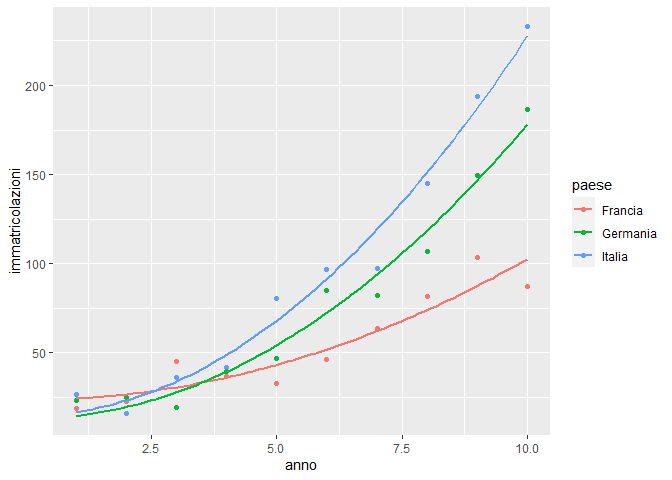
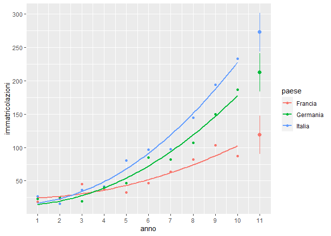

Immatricolazioni in Europa - Regressione e stepwise selection
================

Il file Pb4.txt riporta il numero Y (espresso in migliaia di unità) di
veicoli immatricolati annualmente in tre paesi dell’Unione europea
(Francia, Germania e Italia) durante un periodo di riferimento di 10
anni.

Modelli economici recenti descrivono il comportamento di questa
variabile:

$$
Y | (X = x, G = g) = \beta_{0g} + \beta_{1g} \cdot x^2 + \epsilon
$$

- $\epsilon \sim N(0,\sigma^2)$

- $x :$ anni $\in [1,2,…,10]$

- $g:$ Francia, Germania, Italia

## Dati

### Caricamento dei dati

``` r
pb4 = read.csv("../Datasets/Pb4.txt",sep=" ")
str(pb4)
```

    ## 'data.frame':    10 obs. of  3 variables:
    ##  $ Francia : num  19 22.8 45 36.9 32.6 ...
    ##  $ Germania: num  23.4 25.2 19.5 39.9 46.9 ...
    ##  $ Italia  : num  26.7 16 36.3 41.8 80.5 ...

### Trasformazione del dataset

``` r
head(pb4)
```

    ##   Francia Germania Italia
    ## 1   18.99    23.40  26.68
    ## 2   22.75    25.17  15.97
    ## 3   45.00    19.46  36.31
    ## 4   36.93    39.86  41.80
    ## 5   32.61    46.86  80.48
    ## 6   46.51    85.22  96.91

``` r
pb4$anno <- 1:10
Y = c(pb4$Italia, pb4$Francia, pb4$Germania)
cat = c(rep("Italia",10), rep("Francia", 10), rep("Germania",10))
year = rep(1:10,3)
data = data.frame (immatricolazioni = Y,
                   anno = year,
                   paese = cat)
data$paese <- factor(data$paese)
head(data)
```

    ##   immatricolazioni anno  paese
    ## 1            26.68    1 Italia
    ## 2            15.97    2 Italia
    ## 3            36.31    3 Italia
    ## 4            41.80    4 Italia
    ## 5            80.48    5 Italia
    ## 6            96.91    6 Italia

### Visualizzazione dei dati

``` r
library(tidyverse)
ggplot(data, aes(x=anno, y=immatricolazioni, group=paese))+
  geom_point(aes(color=paese))
```

<!-- -->

## Modello

### Costruzione del modello e stima dei parametri

``` r
library(rgl)
first_model = lm(immatricolazioni ~ paese + I(anno^2) + paese:I(anno^2), data=data)
summary(first_model)
```

    ## 
    ## Call:
    ## lm(formula = immatricolazioni ~ paese + I(anno^2) + paese:I(anno^2), 
    ##     data = data)
    ## 
    ## Residuals:
    ##     Min      1Q  Median      3Q     Max 
    ## -21.821  -7.176   1.165   7.502  16.117 
    ## 
    ## Coefficients:
    ##                         Estimate Std. Error t value Pr(>|t|)    
    ## (Intercept)              23.4917     5.1874   4.529 0.000138 ***
    ## paeseGermania           -10.5285     7.3360  -1.435 0.164142    
    ## paeseItalia              -8.8056     7.3360  -1.200 0.241730    
    ## I(anno^2)                 0.7896     0.1031   7.662 6.72e-08 ***
    ## paeseGermania:I(anno^2)   0.8610     0.1458   5.907 4.28e-06 ***
    ## paeseItalia:I(anno^2)     1.3415     0.1458   9.204 2.42e-09 ***
    ## ---
    ## Signif. codes:  0 '***' 0.001 '**' 0.01 '*' 0.05 '.' 0.1 ' ' 1
    ## 
    ## Residual standard error: 10.57 on 24 degrees of freedom
    ## Multiple R-squared:  0.9717, Adjusted R-squared:  0.9658 
    ## F-statistic:   165 on 5 and 24 DF,  p-value: < 2.2e-16

#### Visualizzazione del modello

``` r
data$y_hat=predict(first_model, newdata = data[,-1])
ggplot(data, aes(x=anno, y=immatricolazioni, group=paese))+
  geom_point(aes(color=paese))+
  geom_smooth(method='lm', aes(x=anno, y=y_hat, color=paese), formula = y ~ poly(x,9),se=FALSE)
```

<!-- -->

### Verifica del modello

#### Verifica gaussianità dei risultati

``` r
#verifica gaussianità dei residui
shapiro.test(first_model$residuals) 
```

    ## 
    ##  Shapiro-Wilk normality test
    ## 
    ## data:  first_model$residuals
    ## W = 0.9713, p-value = 0.5753

Il P-Value (0.5753) è alto =\> è possibile accettare l’ipotesi H0
secondo cui i residui sono distribuiti secondo legge gaussiana.

#### Verifica omoschedasticità

Omoschedasticità: proprietà di una collezione di variabili aleatorie di
avere tutte la stessa varianza finita.

In questo caso si vuole verificare che la varianza dei residui non sia
dipendente dalla X

``` r
#verifica omoschedasticità
plot(first_model$fitted.values, scale(first_model$residuals)) 
abline(h = 0) 
```

<!-- -->

Dal grafico si nota che i residui sono tutti sparsi intorno allo zero:
non hanno pattern particolari e quindi si può concludere che i residui
siano omoschedastici.

#### Strumento alternativo

``` r
par(mfrow=c(2,2)) 
plot(first_model)
```

<!-- -->

- **Gaussianità**: Il secondo grafico mostra il Q-Q Plot dei residui.
  Dal momento che si collocano lungo la diagonale, si può concludere che
  seguano legge normale.

  > Il Q-Q Plot è la rappresentazione grafica dei quantili di una
  > distribuzione. Confronta la distribuzione cumulata della variabile
  > osservata con la distribuzione cumulata della normale. Se la
  > variabile osservata presenta una distribuzione normale, i punti di
  > questa distribuzione congiunta si addensano sulla diagonale che va
  > dal basso verso l’alto e da sinistra verso destra.

- **Omoschedasticità**: Dal primo grafico si possono identificare
  eventuali comportamenti non lineari dei residui rispetto alle X. Se i
  residui sono omoschedastici, ci si aspetta di osservare una “nuvola”
  intorno allo zero senza pattern particolari. La linea rossa permette
  di idenficare eventuali pattern. In questo caso sembra che le X
  spieghino in modo lineare le Y, quindi non sono state ignorate
  eventuali relazioni non lineari.

### Backward Selection

La backward selection parte dal modello più complesso e prova a mano a
mano a eliminare dei predittori con l’obiettivo di averne meno
possibile. Seleziona il modello che minimizza l’AIC, ovvero un indice
che misura quanto il modello è capace di stimare i dati da cui è stato
creato.

``` r
library(MASS)
```

    ## 
    ## Caricamento pacchetto: 'MASS'

    ## Il seguente oggetto è mascherato da 'package:dplyr':
    ## 
    ##     select

``` r
backward = stepAIC(first_model,details = T, direction = "backward")
```

    ## Start:  AIC=146.76
    ## immatricolazioni ~ paese + I(anno^2) + paese:I(anno^2)
    ## 
    ##                   Df Sum of Sq     RSS    AIC
    ## <none>                          2679.4 146.76
    ## - paese:I(anno^2)  2    9710.8 12390.2 188.70

``` r
summary(backward)
```

    ## 
    ## Call:
    ## lm(formula = immatricolazioni ~ paese + I(anno^2) + paese:I(anno^2), 
    ##     data = data)
    ## 
    ## Residuals:
    ##     Min      1Q  Median      3Q     Max 
    ## -21.821  -7.176   1.165   7.502  16.117 
    ## 
    ## Coefficients:
    ##                         Estimate Std. Error t value Pr(>|t|)    
    ## (Intercept)              23.4917     5.1874   4.529 0.000138 ***
    ## paeseGermania           -10.5285     7.3360  -1.435 0.164142    
    ## paeseItalia              -8.8056     7.3360  -1.200 0.241730    
    ## I(anno^2)                 0.7896     0.1031   7.662 6.72e-08 ***
    ## paeseGermania:I(anno^2)   0.8610     0.1458   5.907 4.28e-06 ***
    ## paeseItalia:I(anno^2)     1.3415     0.1458   9.204 2.42e-09 ***
    ## ---
    ## Signif. codes:  0 '***' 0.001 '**' 0.01 '*' 0.05 '.' 0.1 ' ' 1
    ## 
    ## Residual standard error: 10.57 on 24 degrees of freedom
    ## Multiple R-squared:  0.9717, Adjusted R-squared:  0.9658 
    ## F-statistic:   165 on 5 and 24 DF,  p-value: < 2.2e-16

In questo caso la stepwise backward selection non è stata in grado di
eliminare alcun predittore perché si sarebbe avuto un peggioramento
dell’AIC. Il modello suggerito è quindi quello inizialmente formulato.

## Intervalli di previsione

Sulla base del modello sopra formulato, vado a costruire tre intervalli
di previsione per il numero di veicoli registrati nei tre paesi durante
l’undicesimo anno in modo che le tre nuove osservazioni cadranno
simultaneamente all’interno dei rispettivi intervalli con il 95% di
probabilità.

``` r
alpha=0.05
pred_year=11
pred_intervals = predict(first_model, data.frame(paese=levels(data$paese), anno=pred_year), interval = "prediction", level = 1- alpha)
pred_intervals
```

    ##        fit       lwr      upr
    ## 1 119.0386  90.21029 147.8670
    ## 2 212.6943 183.86594 241.5227
    ## 3 272.5509 243.72252 301.3792

### Visualizzazione degli intervalli

``` r
boxplot(t(pred_intervals), names=levels(data$paese), col=c("#F8766D","#00BA38","#619CFF"), main="Intervalli di previsione per immatricolazioni (anno 11)")
```

<!-- -->

``` r
data$y_hat=predict(first_model, newdata = data[,-1])
ggplot(data, aes(x=anno, y=immatricolazioni, group=paese))+
  geom_point(aes(color=paese))+
  geom_smooth(method='lm', aes(x=anno, y=y_hat, color=paese), formula = y ~ poly(x,9), se = FALSE)+
  geom_pointrange(aes(x=11, y=pred_intervals[1,1], ymin=pred_intervals[1,3], ymax=pred_intervals[1,2]), color="#F8766D")+
    geom_pointrange(aes(x=11, y=pred_intervals[2,1], ymin=pred_intervals[2,3], ymax=pred_intervals[2,2]), color="#00BA38")+
    geom_pointrange(aes(x=11, y=pred_intervals[3,1], ymin=pred_intervals[3,3], ymax=pred_intervals[3,2]), color="#619CFF")+
  scale_x_continuous(breaks=seq(1,11,by=1))+
  scale_y_continuous(breaks=seq(0,300,by=50))
```

<!-- -->
