Data Science Competition
================
Alessandro Cavalieri
2023-10-10

# Marketing Campaign Data Analysis

Your Team is the Marketing and Data Department of a food delivery
company, and you are presented a dataset which contains information on
the customers and on previous marketing campaigns interactions with each
customer.

It is your challenge to understand the data, find business opportunities
and insights and to propose any data driven action to optimize the
campaigns results & generate value to the company.

### Key Objectives are:

1.  Explore the data – don’t just plot means and counts. Provide
    insights, define cause and effect. Provide a better understanding of
    the characteristic features of respondents;
2.  Propose and describe a customer segmentation based on customers
    behaviors

## Dataset loading and exploration

``` r
data <- read.csv("../Datasets/marketing_campaign.csv", sep=';')
data <- data[complete.cases(data),] #dropping rows containing null values
head(data)
```

    ##     ID Year_Birth  Education Marital_Status Income Kidhome Teenhome Dt_Customer
    ## 1 5524       1957 Graduation         Single  58138       0        0  2012-09-04
    ## 2 2174       1954 Graduation         Single  46344       1        1  2014-03-08
    ## 3 4141       1965 Graduation       Together  71613       0        0  2013-08-21
    ## 4 6182       1984 Graduation       Together  26646       1        0  2014-02-10
    ## 5 5324       1981        PhD        Married  58293       1        0  2014-01-19
    ## 6 7446       1967     Master       Together  62513       0        1  2013-09-09
    ##   Recency MntWines MntFruits MntMeatProducts MntFishProducts MntSweetProducts
    ## 1      58      635        88             546             172               88
    ## 2      38       11         1               6               2                1
    ## 3      26      426        49             127             111               21
    ## 4      26       11         4              20              10                3
    ## 5      94      173        43             118              46               27
    ## 6      16      520        42              98               0               42
    ##   MntGoldProds NumDealsPurchases NumWebPurchases NumCatalogPurchases
    ## 1           88                 3               8                  10
    ## 2            6                 2               1                   1
    ## 3           42                 1               8                   2
    ## 4            5                 2               2                   0
    ## 5           15                 5               5                   3
    ## 6           14                 2               6                   4
    ##   NumStorePurchases NumWebVisitsMonth AcceptedCmp3 AcceptedCmp4 AcceptedCmp5
    ## 1                 4                 7            0            0            0
    ## 2                 2                 5            0            0            0
    ## 3                10                 4            0            0            0
    ## 4                 4                 6            0            0            0
    ## 5                 6                 5            0            0            0
    ## 6                10                 6            0            0            0
    ##   AcceptedCmp1 AcceptedCmp2 Complain Z_CostContact Z_Revenue Response
    ## 1            0            0        0             3        11        1
    ## 2            0            0        0             3        11        0
    ## 3            0            0        0             3        11        0
    ## 4            0            0        0             3        11        0
    ## 5            0            0        0             3        11        0
    ## 6            0            0        0             3        11        0

``` r
str(data)
```

    ## 'data.frame':    2216 obs. of  29 variables:
    ##  $ ID                 : int  5524 2174 4141 6182 5324 7446 965 6177 4855 5899 ...
    ##  $ Year_Birth         : int  1957 1954 1965 1984 1981 1967 1971 1985 1974 1950 ...
    ##  $ Education          : chr  "Graduation" "Graduation" "Graduation" "Graduation" ...
    ##  $ Marital_Status     : chr  "Single" "Single" "Together" "Together" ...
    ##  $ Income             : int  58138 46344 71613 26646 58293 62513 55635 33454 30351 5648 ...
    ##  $ Kidhome            : int  0 1 0 1 1 0 0 1 1 1 ...
    ##  $ Teenhome           : int  0 1 0 0 0 1 1 0 0 1 ...
    ##  $ Dt_Customer        : chr  "2012-09-04" "2014-03-08" "2013-08-21" "2014-02-10" ...
    ##  $ Recency            : int  58 38 26 26 94 16 34 32 19 68 ...
    ##  $ MntWines           : int  635 11 426 11 173 520 235 76 14 28 ...
    ##  $ MntFruits          : int  88 1 49 4 43 42 65 10 0 0 ...
    ##  $ MntMeatProducts    : int  546 6 127 20 118 98 164 56 24 6 ...
    ##  $ MntFishProducts    : int  172 2 111 10 46 0 50 3 3 1 ...
    ##  $ MntSweetProducts   : int  88 1 21 3 27 42 49 1 3 1 ...
    ##  $ MntGoldProds       : int  88 6 42 5 15 14 27 23 2 13 ...
    ##  $ NumDealsPurchases  : int  3 2 1 2 5 2 4 2 1 1 ...
    ##  $ NumWebPurchases    : int  8 1 8 2 5 6 7 4 3 1 ...
    ##  $ NumCatalogPurchases: int  10 1 2 0 3 4 3 0 0 0 ...
    ##  $ NumStorePurchases  : int  4 2 10 4 6 10 7 4 2 0 ...
    ##  $ NumWebVisitsMonth  : int  7 5 4 6 5 6 6 8 9 20 ...
    ##  $ AcceptedCmp3       : int  0 0 0 0 0 0 0 0 0 1 ...
    ##  $ AcceptedCmp4       : int  0 0 0 0 0 0 0 0 0 0 ...
    ##  $ AcceptedCmp5       : int  0 0 0 0 0 0 0 0 0 0 ...
    ##  $ AcceptedCmp1       : int  0 0 0 0 0 0 0 0 0 0 ...
    ##  $ AcceptedCmp2       : int  0 0 0 0 0 0 0 0 0 0 ...
    ##  $ Complain           : int  0 0 0 0 0 0 0 0 0 0 ...
    ##  $ Z_CostContact      : int  3 3 3 3 3 3 3 3 3 3 ...
    ##  $ Z_Revenue          : int  11 11 11 11 11 11 11 11 11 11 ...
    ##  $ Response           : int  1 0 0 0 0 0 0 0 1 0 ...

### **Content**

- **AcceptedCmp1** - 1 if customer accepted the offer in the 1st
  campaign, 0 otherwise

- **AcceptedCmp2** - 1 if customer accepted the offer in the 2nd
  campaign, 0 otherwise

- **AcceptedCmp3** - 1 if customer accepted the offer in the 3rd
  campaign, 0 otherwise

- **AcceptedCmp4** - 1 if customer accepted the offer in the 4th
  campaign, 0 otherwise

- **AcceptedCmp5** - 1 if customer accepted the offer in the 5th
  campaign, 0 otherwise

- **Response** (target) - 1 if customer accepted the offer in the last
  campaign, 0 otherwise

- **Complain** - 1 if customer complained in the last 2 years

- **DtCustomer** - date of customer's enrolment with the company

- **Education** - customer's level of education

- **Marital** - customer's marital status

- **Kidhome** - number of small children in customer's household

- **Teenhome** - number of teenagers in customer's household

- **Income** - customer's yearly household income

- **MntFishProducts** - amount spent on fish products in the last 2
  years

- **MntMeatProducts** - amount spent on meat products in the last 2
  years

- **MntFruits** - amount spent on fruits products in the last 2 years

- **MntSweetProducts** - amount spent on sweet products in the last 2
  years

- **MntWines** - amount spent on wine products in the last 2 years

- **MntGoldProds** - amount spent on gold products in the last 2 years

- **NumDealsPurchases** - number of purchases made with discount

- **NumCatalogPurchases** - number of purchases made using catalogue

- **NumStorePurchases** - number of purchases made directly in stores

- **NumWebPurchases** - number of purchases made through company's web
  site

- **NumWebVisitsMonth** - number of visits to company's web site in the
  last month

- **Recency** - number of days since the last purchase

## Principal Component Analysis

``` r
library(dplyr)
```

    ## 
    ## Caricamento pacchetto: 'dplyr'

    ## I seguenti oggetti sono mascherati da 'package:stats':
    ## 
    ##     filter, lag

    ## I seguenti oggetti sono mascherati da 'package:base':
    ## 
    ##     intersect, setdiff, setequal, union

``` r
library(tidyverse)
```

    ## ── Attaching core tidyverse packages ──────────────────────── tidyverse 2.0.0 ──
    ## ✔ forcats   1.0.0     ✔ readr     2.1.4
    ## ✔ ggplot2   3.4.1     ✔ stringr   1.5.0
    ## ✔ lubridate 1.9.2     ✔ tibble    3.1.8
    ## ✔ purrr     1.0.1     ✔ tidyr     1.3.0

    ## ── Conflicts ────────────────────────────────────────── tidyverse_conflicts() ──
    ## ✖ dplyr::filter() masks stats::filter()
    ## ✖ dplyr::lag()    masks stats::lag()
    ## ℹ Use the ]8;;http://conflicted.r-lib.org/conflicted package]8;; to force all conflicts to become errors

``` r
#extracting only numeric feature
data_num <- data %>% select_if(is.numeric)
str(data_num)
```

    ## 'data.frame':    2216 obs. of  26 variables:
    ##  $ ID                 : int  5524 2174 4141 6182 5324 7446 965 6177 4855 5899 ...
    ##  $ Year_Birth         : int  1957 1954 1965 1984 1981 1967 1971 1985 1974 1950 ...
    ##  $ Income             : int  58138 46344 71613 26646 58293 62513 55635 33454 30351 5648 ...
    ##  $ Kidhome            : int  0 1 0 1 1 0 0 1 1 1 ...
    ##  $ Teenhome           : int  0 1 0 0 0 1 1 0 0 1 ...
    ##  $ Recency            : int  58 38 26 26 94 16 34 32 19 68 ...
    ##  $ MntWines           : int  635 11 426 11 173 520 235 76 14 28 ...
    ##  $ MntFruits          : int  88 1 49 4 43 42 65 10 0 0 ...
    ##  $ MntMeatProducts    : int  546 6 127 20 118 98 164 56 24 6 ...
    ##  $ MntFishProducts    : int  172 2 111 10 46 0 50 3 3 1 ...
    ##  $ MntSweetProducts   : int  88 1 21 3 27 42 49 1 3 1 ...
    ##  $ MntGoldProds       : int  88 6 42 5 15 14 27 23 2 13 ...
    ##  $ NumDealsPurchases  : int  3 2 1 2 5 2 4 2 1 1 ...
    ##  $ NumWebPurchases    : int  8 1 8 2 5 6 7 4 3 1 ...
    ##  $ NumCatalogPurchases: int  10 1 2 0 3 4 3 0 0 0 ...
    ##  $ NumStorePurchases  : int  4 2 10 4 6 10 7 4 2 0 ...
    ##  $ NumWebVisitsMonth  : int  7 5 4 6 5 6 6 8 9 20 ...
    ##  $ AcceptedCmp3       : int  0 0 0 0 0 0 0 0 0 1 ...
    ##  $ AcceptedCmp4       : int  0 0 0 0 0 0 0 0 0 0 ...
    ##  $ AcceptedCmp5       : int  0 0 0 0 0 0 0 0 0 0 ...
    ##  $ AcceptedCmp1       : int  0 0 0 0 0 0 0 0 0 0 ...
    ##  $ AcceptedCmp2       : int  0 0 0 0 0 0 0 0 0 0 ...
    ##  $ Complain           : int  0 0 0 0 0 0 0 0 0 0 ...
    ##  $ Z_CostContact      : int  3 3 3 3 3 3 3 3 3 3 ...
    ##  $ Z_Revenue          : int  11 11 11 11 11 11 11 11 11 11 ...
    ##  $ Response           : int  1 0 0 0 0 0 0 0 1 0 ...

``` r
#check if all the values in these columns are the same
all(data_num$Z_CostContact == 3)
```

    ## [1] TRUE

``` r
all(data_num$Z_Revenue == 11)
```

    ## [1] TRUE

``` r
#they are all the same, so they won't contribute to explain variance, thus can be removed
data_num[,24:25] = NULL

#proceeding with the pca
pca = princomp(scale(data_num), scores=T)

#plotting pca
plot(cumsum(pca$sd^2)/sum(pca$sd^2), type='b', axes=F, xlab='number of components', 
     ylab='contribution to the total variance', ylim=c(0,1), lwd=2)
abline(h=1, col='red', lwd=1.5)
abline(h=0.8, lty=2, col='blue', lwd=1.5)
box()
axis(2, at=0:10/10, labels=0:10/10)
axis(1, at=1:ncol(data_num), labels=1:ncol(data_num), las=2)
```

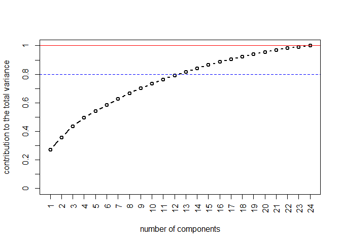<!-- -->

``` r
k=3
par(mar = c(1,4,0,2), mfrow = c(k,1))
for(i in 1:k){
  pca_component_df <- data.frame(Variable = rownames(pca$loadings),
                                  Loadings = pca$loadings[, i])
  print(ggplot(pca_component_df, aes(x=Variable, y=Loadings))+
    geom_bar(stat='identity')+
    ggtitle(paste("Component number ",i))+
    coord_flip())
}
```

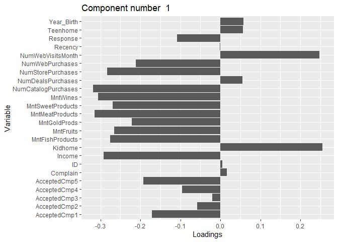<!-- -->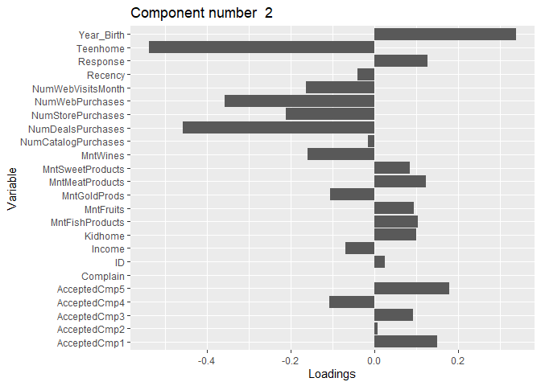<!-- -->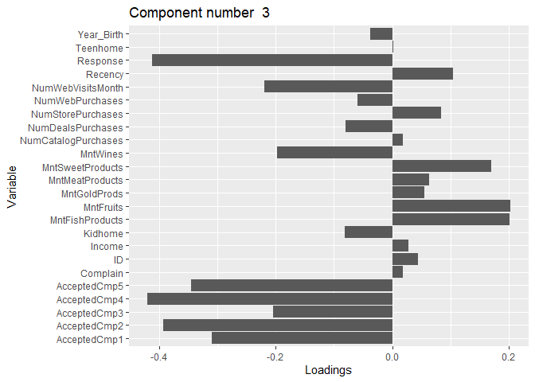<!-- -->

There seem to be many relevant features that explain the variance, and
also looking at the principal components the interpretation is not
immediate.

I would try to apply unsupervised clustering algorithms for further
analysis

## Monthly spending clustering

I’ll start with the analysis of the columns representing the spent
amount on different products in the last two years.

- **MntFishProducts** - amount spent on fish products in the last 2
  years

- **MntMeatProducts** - amount spent on meat products in the last 2
  years

- **MntFruits** - amount spent on fruits products in the last 2 years

- **MntSweetProducts** - amount spent on sweet products in the last 2
  years

- **MntWines** - amount spent on wine products in the last 2 years

- **MntGoldProds** - amount spent on gold products in the last 2 years

For the purpose of the insights, I’ll avoid to take MntGoldProds into
account for this analysis only because I can’t fully understand it’s
meaning.

Firstly, let’s check for correlations between these variables, so maybe
we can reduce them.

``` r
data_mnt <- data[,c('MntFishProducts','MntMeatProducts','MntFruits','MntSweetProducts','MntWines')]

library(corrplot)
```

    ## corrplot 0.92 loaded

``` r
correlation_matrix <- cor(data_mnt)
corrplot(correlation_matrix, method = "color", type = "upper", tl.col = "black", tl.srt = 45)
```

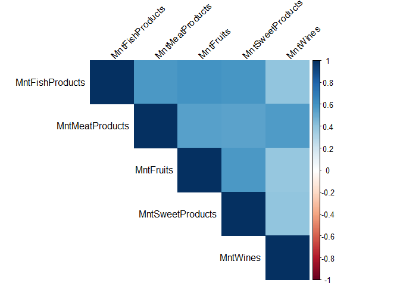<!-- -->

There seem to be correlation between all the variables, probably that’s
because people who spend more on some product category just spend more
in general.

Let’s use PCA again to see if we can find something more interesting.

``` r
pca_mnt = princomp(scale(data_mnt), scores=T)

#plotting pca
plot(cumsum(pca_mnt$sd^2)/sum(pca_mnt$sd^2), type='b', axes=F, xlab='number of components', 
     ylab='contribution to the total variance', ylim=c(0,1), lwd=2)
abline(h=1, col='red', lwd=1.5)
abline(h=0.8, lty=2, col='blue', lwd=1.5)
box()
axis(2, at=0:10/10, labels=0:10/10)
axis(1, at=1:ncol(data_mnt), labels=1:ncol(data_mnt), las=2)
```

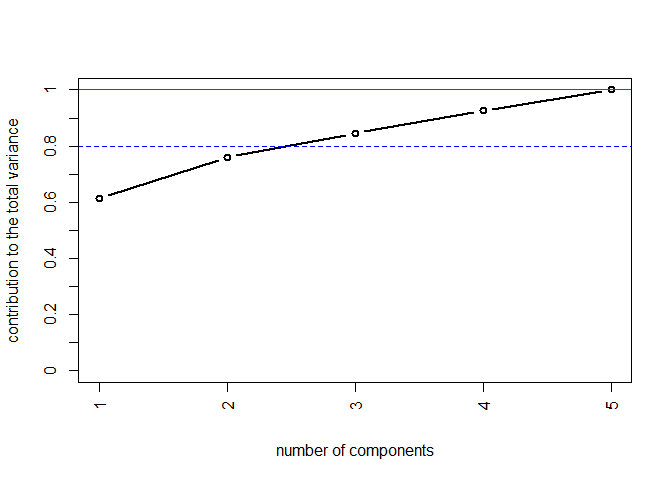<!-- -->

I’ll extract the first three components as they explain over 80% of the
total variance.

``` r
k=3
par(mar = c(1,4,0,2), mfrow = c(k,1))
for(i in 1:k){
  pca_component_df <- data.frame(Variable = rownames(pca_mnt$loadings),
                                  Loadings = pca_mnt$loadings[, i])
  print(ggplot(pca_component_df, aes(x=Variable, y=Loadings))+
    geom_bar(stat='identity')+
    ggtitle(paste("Component number ",i))+
    coord_flip())
}
```

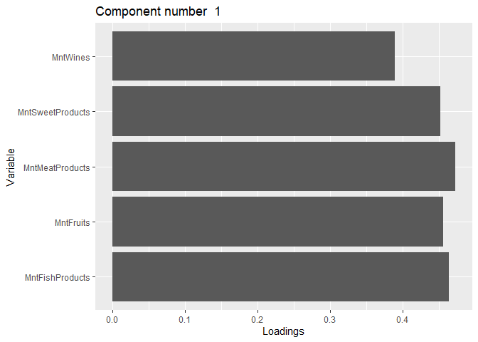<!-- -->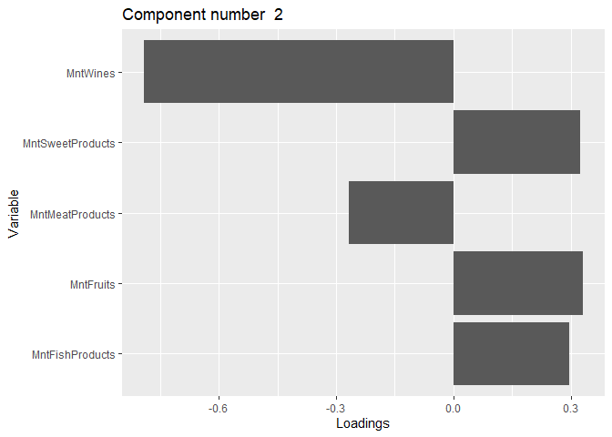<!-- -->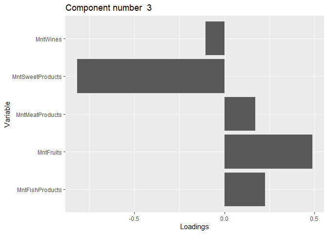<!-- -->

``` r
pca_mnt$loadings
```

    ## 
    ## Loadings:
    ##                  Comp.1 Comp.2 Comp.3 Comp.4 Comp.5
    ## MntFishProducts   0.463  0.295  0.227  0.664  0.453
    ## MntMeatProducts   0.472 -0.268  0.173  0.262 -0.779
    ## MntFruits         0.455  0.331  0.489 -0.664       
    ## MntSweetProducts  0.452  0.324 -0.817 -0.136       
    ## MntWines          0.389 -0.791 -0.104 -0.175  0.426
    ## 
    ##                Comp.1 Comp.2 Comp.3 Comp.4 Comp.5
    ## SS loadings       1.0    1.0    1.0    1.0    1.0
    ## Proportion Var    0.2    0.2    0.2    0.2    0.2
    ## Cumulative Var    0.2    0.4    0.6    0.8    1.0

The first component seem to be targeting high spending customers, the
interpretation of the other two is more complicated.

I can now try to find groups with K-means clustering.

### K-Means Clustering

``` r
set.seed(2)


km.output = kmeans(data_mnt, centers = 2)
plot(data_mnt, col=km.output$cluster, main="K-Means Clustering Results with K=2")
```

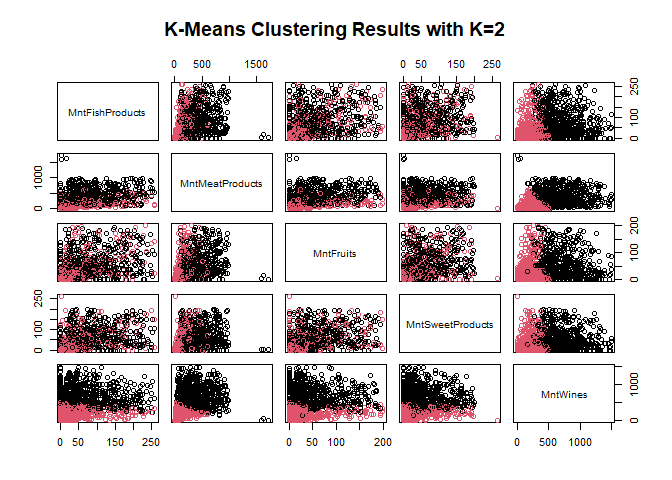<!-- -->

``` r
results <- data.frame(Tot.Withinss = NA)
km.output$tot.withinss
```

    ## [1] 148564124

``` r
km.output = kmeans(data_mnt, centers = 3)
plot(data_mnt, col=km.output$cluster, main="K-Means Clustering Results with K=3")
```

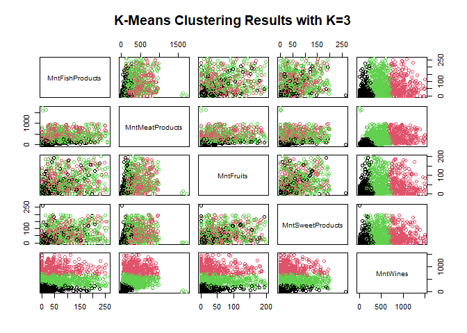<!-- -->

``` r
results <- data.frame(Tot.Withinss = NA)
km.output$tot.withinss
```

    ## [1] 103570288

``` r
km.output = kmeans(data_mnt, centers = 4)
plot(data_mnt, col=km.output$cluster, main="K-Means Clustering Results with K=4")
```

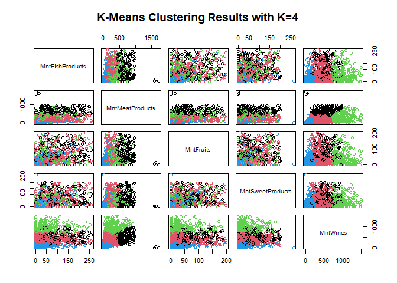<!-- -->

``` r
results <- data.frame(Tot.Withinss = NA)
km.output$tot.withinss
```

    ## [1] 74459005

``` r
km.output = kmeans(data_mnt, centers = 5)
plot(data_mnt, col=km.output$cluster, main="K-Means Clustering Results with K=5")
```

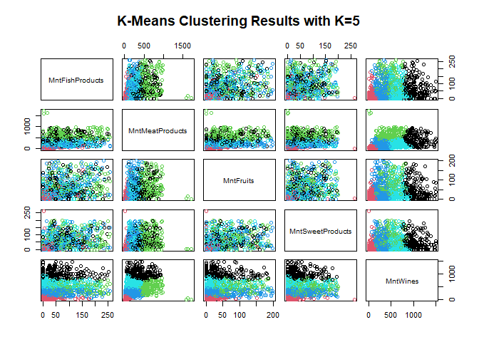<!-- -->

``` r
results <- data.frame(Tot.Withinss = NA)
km.output$tot.withinss
```

    ## [1] 62093081

``` r
data_hc <- data[,c('MntFishProducts','MntMeatProducts','MntFruits')]
metric <- dist(data_hc)
metric_matrix = as.matrix(metric)
# Linkage completo
hc.complete = hclust(metric, method="complete")
# Linkage average
hc.average = hclust(metric, method="average")
# Single Linkage
hc.single = hclust(metric, method="single")

# plotting dendograms
par(mfrow=c(1,3))
plot(hc.complete,main="Complete Linkage", xlab="", sub="", cex=.9)
plot(hc.average, main="Average Linkage", xlab="", sub="", cex=.9)
plot(hc.single, main="Single Linkage", xlab="", sub="", cex=.9)
```

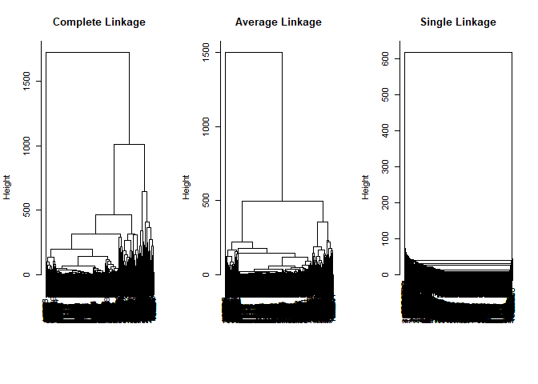<!-- -->

``` r
# k=4 clusters:
clusters_complete = cutree(hc.complete, 5)

library(rgl)
plot3d(data_hc, col = clusters_complete,size=6)
```

## Extra

### Logistic regression

``` r
library(MASS)
```

    ## 
    ## Caricamento pacchetto: 'MASS'

    ## Il seguente oggetto è mascherato da 'package:dplyr':
    ## 
    ##     select

``` r
library(car)
```

    ## Caricamento del pacchetto richiesto: carData

    ## 
    ## Caricamento pacchetto: 'car'

    ## Il seguente oggetto è mascherato da 'package:purrr':
    ## 
    ##     some

    ## Il seguente oggetto è mascherato da 'package:dplyr':
    ## 
    ##     recode

``` r
library(rgl)
library(GGally)
```

    ## Registered S3 method overwritten by 'GGally':
    ##   method from   
    ##   +.gg   ggplot2

``` r
library(titanic)
```

    ## Warning: il pacchetto 'titanic' è stato creato con R versione 4.2.3

``` r
library(PRROC)
```

    ## Warning: il pacchetto 'PRROC' è stato creato con R versione 4.2.3

``` r
#Converting Dt_Customer to Date type
data$Dt_Customer <- as.Date(data$Dt_Customer)
#Extract year from Dt_Customer and save it as new column
data$year <- as.integer(format(data$Dt_Customer, "%Y"))

#Categorical data factorization
data$year <- as.factor(data$year)
data$Complain <- as.factor(data$Complain)
data$Education <- as.factor(data$Education)
data$Marital_Status <- as.factor(data$Marital_Status)

str(data)
```

    ## 'data.frame':    2216 obs. of  30 variables:
    ##  $ ID                 : int  5524 2174 4141 6182 5324 7446 965 6177 4855 5899 ...
    ##  $ Year_Birth         : int  1957 1954 1965 1984 1981 1967 1971 1985 1974 1950 ...
    ##  $ Education          : Factor w/ 5 levels "2n Cycle","Basic",..: 3 3 3 3 5 4 3 5 5 5 ...
    ##  $ Marital_Status     : Factor w/ 8 levels "Absurd","Alone",..: 5 5 6 6 4 6 3 4 6 6 ...
    ##  $ Income             : int  58138 46344 71613 26646 58293 62513 55635 33454 30351 5648 ...
    ##  $ Kidhome            : int  0 1 0 1 1 0 0 1 1 1 ...
    ##  $ Teenhome           : int  0 1 0 0 0 1 1 0 0 1 ...
    ##  $ Dt_Customer        : Date, format: "2012-09-04" "2014-03-08" ...
    ##  $ Recency            : int  58 38 26 26 94 16 34 32 19 68 ...
    ##  $ MntWines           : int  635 11 426 11 173 520 235 76 14 28 ...
    ##  $ MntFruits          : int  88 1 49 4 43 42 65 10 0 0 ...
    ##  $ MntMeatProducts    : int  546 6 127 20 118 98 164 56 24 6 ...
    ##  $ MntFishProducts    : int  172 2 111 10 46 0 50 3 3 1 ...
    ##  $ MntSweetProducts   : int  88 1 21 3 27 42 49 1 3 1 ...
    ##  $ MntGoldProds       : int  88 6 42 5 15 14 27 23 2 13 ...
    ##  $ NumDealsPurchases  : int  3 2 1 2 5 2 4 2 1 1 ...
    ##  $ NumWebPurchases    : int  8 1 8 2 5 6 7 4 3 1 ...
    ##  $ NumCatalogPurchases: int  10 1 2 0 3 4 3 0 0 0 ...
    ##  $ NumStorePurchases  : int  4 2 10 4 6 10 7 4 2 0 ...
    ##  $ NumWebVisitsMonth  : int  7 5 4 6 5 6 6 8 9 20 ...
    ##  $ AcceptedCmp3       : int  0 0 0 0 0 0 0 0 0 1 ...
    ##  $ AcceptedCmp4       : int  0 0 0 0 0 0 0 0 0 0 ...
    ##  $ AcceptedCmp5       : int  0 0 0 0 0 0 0 0 0 0 ...
    ##  $ AcceptedCmp1       : int  0 0 0 0 0 0 0 0 0 0 ...
    ##  $ AcceptedCmp2       : int  0 0 0 0 0 0 0 0 0 0 ...
    ##  $ Complain           : Factor w/ 2 levels "0","1": 1 1 1 1 1 1 1 1 1 1 ...
    ##  $ Z_CostContact      : int  3 3 3 3 3 3 3 3 3 3 ...
    ##  $ Z_Revenue          : int  11 11 11 11 11 11 11 11 11 11 ...
    ##  $ Response           : int  1 0 0 0 0 0 0 0 1 0 ...
    ##  $ year               : Factor w/ 3 levels "2012","2013",..: 1 3 2 3 3 2 1 2 2 3 ...

``` r
#Logistic regression model
log_model_1 <- glm(Response ~ .-AcceptedCmp1-AcceptedCmp2-AcceptedCmp3-AcceptedCmp4-AcceptedCmp5-Dt_Customer, family=binomial(link=logit), data)
summary(log_model_1) 
```

    ## 
    ## Call:
    ## glm(formula = Response ~ . - AcceptedCmp1 - AcceptedCmp2 - AcceptedCmp3 - 
    ##     AcceptedCmp4 - AcceptedCmp5 - Dt_Customer, family = binomial(link = logit), 
    ##     data = data)
    ## 
    ## Deviance Residuals: 
    ##     Min       1Q   Median       3Q      Max  
    ## -3.0952  -0.4876  -0.3005  -0.1417   2.8630  
    ## 
    ## Coefficients: (2 not defined because of singularities)
    ##                          Estimate Std. Error z value Pr(>|z|)    
    ## (Intercept)            -1.393e+00  1.272e+01  -0.110 0.912773    
    ## ID                     -2.915e-05  2.181e-05  -1.336 0.181488    
    ## Year_Birth              8.295e-04  6.366e-03   0.130 0.896325    
    ## EducationBasic         -1.253e+00  7.922e-01  -1.581 0.113803    
    ## EducationGraduation     1.988e-01  2.811e-01   0.707 0.479318    
    ## EducationMaster         3.616e-01  3.200e-01   1.130 0.258539    
    ## EducationPhD            8.091e-01  3.054e-01   2.649 0.008061 ** 
    ## Marital_StatusAlone    -2.614e-01  1.992e+00  -0.131 0.895603    
    ## Marital_StatusDivorced -9.656e-01  1.529e+00  -0.631 0.527820    
    ## Marital_StatusMarried  -2.036e+00  1.522e+00  -1.337 0.181067    
    ## Marital_StatusSingle   -9.986e-01  1.524e+00  -0.655 0.512185    
    ## Marital_StatusTogether -2.039e+00  1.526e+00  -1.336 0.181391    
    ## Marital_StatusWidow    -8.724e-01  1.552e+00  -0.562 0.573919    
    ## Marital_StatusYOLO     -1.333e+00  2.095e+00  -0.636 0.524599    
    ## Income                  2.478e-06  3.032e-06   0.817 0.413803    
    ## Kidhome                 3.388e-01  1.934e-01   1.752 0.079734 .  
    ## Teenhome               -1.077e+00  1.826e-01  -5.899 3.65e-09 ***
    ## Recency                -2.797e-02  2.687e-03 -10.409  < 2e-16 ***
    ## MntWines                1.610e-03  2.875e-04   5.600 2.14e-08 ***
    ## MntFruits               5.253e-04  2.092e-03   0.251 0.801697    
    ## MntMeatProducts         1.671e-03  4.474e-04   3.735 0.000188 ***
    ## MntFishProducts        -2.550e-03  1.663e-03  -1.534 0.125068    
    ## MntSweetProducts        1.850e-03  2.059e-03   0.899 0.368761    
    ## MntGoldProds            3.939e-03  1.450e-03   2.716 0.006608 ** 
    ## NumDealsPurchases       2.118e-02  4.390e-02   0.483 0.629434    
    ## NumWebPurchases         8.003e-02  3.042e-02   2.630 0.008527 ** 
    ## NumCatalogPurchases     1.100e-01  3.631e-02   3.029 0.002455 ** 
    ## NumStorePurchases      -1.921e-01  3.112e-02  -6.173 6.70e-10 ***
    ## NumWebVisitsMonth       1.378e-01  4.334e-02   3.181 0.001468 ** 
    ## Complain1               3.926e-02  8.246e-01   0.048 0.962029    
    ## Z_CostContact                  NA         NA      NA       NA    
    ## Z_Revenue                      NA         NA      NA       NA    
    ## year2013               -8.496e-01  1.668e-01  -5.095 3.49e-07 ***
    ## year2014               -1.253e+00  2.280e-01  -5.495 3.91e-08 ***
    ## ---
    ## Signif. codes:  0 '***' 0.001 '**' 0.01 '*' 0.05 '.' 0.1 ' ' 1
    ## 
    ## (Dispersion parameter for binomial family taken to be 1)
    ## 
    ##     Null deviance: 1875.5  on 2215  degrees of freedom
    ## Residual deviance: 1351.5  on 2184  degrees of freedom
    ## AIC: 1415.5
    ## 
    ## Number of Fisher Scoring iterations: 6

``` r
# Coefficient estimates and standard errors from the logistic regression model
coefficients <- coef(log_model_1)
std_errors <- summary(log_model_1)$coef[, "Std. Error"]

# Extract significant variables (those with p-value < 0.05)
significant_indices <- which(summary(log_model_1)$coef[, "Pr(>|z|)"] < 0.05)
significant_variables <- coefficients[significant_indices]
significant_std_errors <- std_errors[significant_indices]

# Calculate odds ratios and 95% confidence intervals
odds_ratios <- exp(significant_variables)

# Calculate lower and upper confidence intervals
lower_ci <- exp(significant_variables - 1.96 * significant_std_errors)
upper_ci <- exp(significant_variables + 1.96 * significant_std_errors)

# Create a data frame to display odds ratios and confidence intervals
odds_ratios_df <- data.frame(
  Variable = names(odds_ratios),
  Odds_Ratio = odds_ratios,
  Lower_CI_95 = lower_ci,
  Upper_CI_95 = upper_ci
)

# Print the odds ratios and confidence intervals
print(odds_ratios_df)
```

    ##                                Variable Odds_Ratio Lower_CI_95 Upper_CI_95
    ## EducationPhD               EducationPhD  2.2457920   1.2343505   4.0860206
    ## Teenhome                       Teenhome  0.3406068   0.2381508   0.4871407
    ## Recency                         Recency  0.9724160   0.9673079   0.9775512
    ## MntWines                       MntWines  1.0016114   1.0010471   1.0021759
    ## MntMeatProducts         MntMeatProducts  1.0016723   1.0007944   1.0025510
    ## MntGoldProds               MntGoldProds  1.0039464   1.0010969   1.0068041
    ## NumWebPurchases         NumWebPurchases  1.0833191   1.0206075   1.1498839
    ## NumCatalogPurchases NumCatalogPurchases  1.1162675   1.0395768   1.1986159
    ## NumStorePurchases     NumStorePurchases  0.8252316   0.7764034   0.8771305
    ## NumWebVisitsMonth     NumWebVisitsMonth  1.1478029   1.0543330   1.2495592
    ## Z_CostContact             Z_CostContact         NA          NA          NA
    ## Z_Revenue                     Z_Revenue         NA          NA          NA

The odds ratios in the table shows that customers who have PhD education
and people who make many catalog purchases or visit the website are more
likely to accept the marketing campaign. The suggestion for the
marketing team would be to find ways to promote the website views and
try to target more the less educated people. At the moment the marketing
campaign seems to be relevant only for the people who actively search
for it, posters in the shops may be useful to increase visibility.
