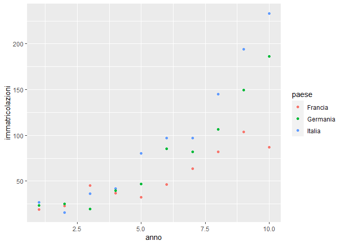

pb4
================

# PB4 - Regression

Il file Pb4.txt riporta il numero Y (espresso in migliaia di unità) di
veicoli immatricolati annualmente in tre paesi dell’Unione europea
(Francia, Germania e Italia) durante un periodo di riferimento di 10
anni.

Modelli economici recenti descrivono il comportamento di questa
variabile:

$$
Y | (X = x, G = g) = \beta_{0g} + \beta_{1g} \cdot x^2 + \epsilon
$$

- $\epsilon \sim N(0,\sigma^2)$

- $x :$ anni $\in [1,2,…,10]$

- $g:$ Francia, Germania, Italia

### Caricamento dei dati

``` r
pb4 = read.csv("../Datasets/Pb4.txt",sep=" ")
str(pb4)
```

    ## 'data.frame':    10 obs. of  3 variables:
    ##  $ Francia : num  19 22.8 45 36.9 32.6 ...
    ##  $ Germania: num  23.4 25.2 19.5 39.9 46.9 ...
    ##  $ Italia  : num  26.7 16 36.3 41.8 80.5 ...

### Trasformazione del dataset

``` r
head(pb4)
```

    ##   Francia Germania Italia
    ## 1   18.99    23.40  26.68
    ## 2   22.75    25.17  15.97
    ## 3   45.00    19.46  36.31
    ## 4   36.93    39.86  41.80
    ## 5   32.61    46.86  80.48
    ## 6   46.51    85.22  96.91

``` r
pb4$anno <- 1:10
Y = c(pb4$Italia, pb4$Francia, pb4$Germania)
cat = c(rep("Italia",10), rep("Francia", 10), rep("Germania",10))
year = rep(1:10,3)
data = data.frame (immatricolazioni = Y,
                   anno = year,
                   paese = cat)
data$paese <- factor(data$paese)
head(data)
```

    ##   immatricolazioni anno  paese
    ## 1            26.68    1 Italia
    ## 2            15.97    2 Italia
    ## 3            36.31    3 Italia
    ## 4            41.80    4 Italia
    ## 5            80.48    5 Italia
    ## 6            96.91    6 Italia

### Visualizzazione dei dati

``` r
library(tidyverse)
```

    ## ── Attaching core tidyverse packages ──────────────────────── tidyverse 2.0.0 ──
    ## ✔ dplyr     1.1.0     ✔ readr     2.1.4
    ## ✔ forcats   1.0.0     ✔ stringr   1.5.0
    ## ✔ ggplot2   3.4.1     ✔ tibble    3.1.8
    ## ✔ lubridate 1.9.2     ✔ tidyr     1.3.0
    ## ✔ purrr     1.0.1     
    ## ── Conflicts ────────────────────────────────────────── tidyverse_conflicts() ──
    ## ✖ dplyr::filter() masks stats::filter()
    ## ✖ dplyr::lag()    masks stats::lag()
    ## ℹ Use the ]8;;http://conflicted.r-lib.org/conflicted package]8;; to force all conflicts to become errors

``` r
ggplot(data, aes(x=anno, y=immatricolazioni, group=paese))+
  geom_point(aes(color=paese))
```

<!-- -->

### Costruzione del modello e stima dei parametri

``` r
library(rgl)
first_model = lm(immatricolazioni ~ paese + I(anno^2) + paese:I(anno^2), data=data)
summary(first_model)
```

    ## 
    ## Call:
    ## lm(formula = immatricolazioni ~ paese + I(anno^2) + paese:I(anno^2), 
    ##     data = data)
    ## 
    ## Residuals:
    ##     Min      1Q  Median      3Q     Max 
    ## -21.821  -7.176   1.165   7.502  16.117 
    ## 
    ## Coefficients:
    ##                         Estimate Std. Error t value Pr(>|t|)    
    ## (Intercept)              23.4917     5.1874   4.529 0.000138 ***
    ## paeseGermania           -10.5285     7.3360  -1.435 0.164142    
    ## paeseItalia              -8.8056     7.3360  -1.200 0.241730    
    ## I(anno^2)                 0.7896     0.1031   7.662 6.72e-08 ***
    ## paeseGermania:I(anno^2)   0.8610     0.1458   5.907 4.28e-06 ***
    ## paeseItalia:I(anno^2)     1.3415     0.1458   9.204 2.42e-09 ***
    ## ---
    ## Signif. codes:  0 '***' 0.001 '**' 0.01 '*' 0.05 '.' 0.1 ' ' 1
    ## 
    ## Residual standard error: 10.57 on 24 degrees of freedom
    ## Multiple R-squared:  0.9717, Adjusted R-squared:  0.9658 
    ## F-statistic:   165 on 5 and 24 DF,  p-value: < 2.2e-16

\#con eps \~ N (0, sigma ^ 2), x = 1, 2,. . . , 10 (anni) e

\#g = Francia, Germania, Italia (EU country).

\#(a) Stimare i 7 parametri del modello (SETTE: 3 intercette (beta0_g),
3 pendenze (beta1_g) e sigma^2)

\#(b) utilizzando test statistici appropriati, dichiarare se si ritiene
necessario

\#    includere nel modello:

\#    1. la variabile x^2;

\#    2. la variable G;

\#    3. l’effetto della variabile G sul coefficiente che moltiplica il

\#       regressore x^2;

\#    4. l’effetto della variabile G sull’intercetta

\#(c) Una volta identificato il “miglior modello”, costruire tre
intervalli di previsione

\#    per il numero di veicoli registrati nei tre paesi durante
l’undicesimo anno,

\#    in modo che le tre nuove osservazioni cadranno simultaneamente
all’interno

\#    dei rispettivi intervalli con il 95% di probabilità.

  
