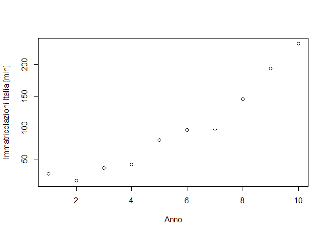

pb4
================

# PB4 - Regression

Il file Pb4.txt riporta il numero Y (espresso in migliaia di unità) di
veicoli immatricolati annualmente in tre paesi dell’Unione europea
(Francia, Germania e Italia) durante un periodo di riferimento di 10
anni.

Modelli economici recenti descrivono il comportamento di questa
variabile:

$$
Y | (X = x, G = g) = \beta_{0g} + \beta_{1g} \cdot x^2 + \epsilon
$$

- $\epsilon \sim N(0,\sigma^2)$

- $x :$ anni $\in [1,2,…,10]$

- $g:$ Francia, Germania, Italia

### Caricamento dei dati

``` r
pb4 = read.csv("../Datasets/Pb4.txt",sep=" ")
pb4$x <- 1:10
pb4
```

    ##    Francia Germania Italia  x
    ## 1    18.99    23.40  26.68  1
    ## 2    22.75    25.17  15.97  2
    ## 3    45.00    19.46  36.31  3
    ## 4    36.93    39.86  41.80  4
    ## 5    32.61    46.86  80.48  5
    ## 6    46.51    85.22  96.91  6
    ## 7    63.71    82.27  97.29  7
    ## 8    81.78   106.83 144.87  8
    ## 9   103.57   149.71 194.06  9
    ## 10   87.08   186.36 232.97 10

### Visualizzazione dei dati

``` r
plot(pb4$x, pb4$Italia, xlab="Anno", ylab="Immatricolazioni Italia [mln]")
```

<!-- -->

### Stima dei parametri del modello

``` r
library(rgl)
pb4_lm_italy = lm(Italia ~ x, data=pb4)
summary(pb4_lm_italy)
```

    ## 
    ## Call:
    ## lm(formula = Italia ~ x, data = pb4)
    ## 
    ## Residuals:
    ##    Min     1Q Median     3Q    Max 
    ## -34.25 -11.04  -3.53  12.19  34.37 
    ## 
    ## Coefficients:
    ##             Estimate Std. Error t value Pr(>|t|)    
    ## (Intercept)  -30.897     15.813  -1.954   0.0865 .  
    ## x             23.206      2.549   9.105  1.7e-05 ***
    ## ---
    ## Signif. codes:  0 '***' 0.001 '**' 0.01 '*' 0.05 '.' 0.1 ' ' 1
    ## 
    ## Residual standard error: 23.15 on 8 degrees of freedom
    ## Multiple R-squared:  0.912,  Adjusted R-squared:  0.901 
    ## F-statistic: 82.91 on 1 and 8 DF,  p-value: 1.701e-05

``` r
pb4_lm_italy = lm(Italia ~ x + I(x^2), data=pb4)
summary(pb4_lm_italy)
```

    ## 
    ## Call:
    ## lm(formula = Italia ~ x + I(x^2), data = pb4)
    ## 
    ## Residuals:
    ##     Min      1Q  Median      3Q     Max 
    ## -19.026  -4.875   2.012   5.446  15.650 
    ## 
    ## Coefficients:
    ##             Estimate Std. Error t value Pr(>|t|)   
    ## (Intercept)  24.9318    13.2362   1.884  0.10162   
    ## x            -4.7089     5.5280  -0.852  0.42249   
    ## I(x^2)        2.5377     0.4898   5.182  0.00128 **
    ## ---
    ## Signif. codes:  0 '***' 0.001 '**' 0.01 '*' 0.05 '.' 0.1 ' ' 1
    ## 
    ## Residual standard error: 11.25 on 7 degrees of freedom
    ## Multiple R-squared:  0.9818, Adjusted R-squared:  0.9766 
    ## F-statistic: 188.8 on 2 and 7 DF,  p-value: 8.131e-07

\#con eps \~ N (0, sigma ^ 2), x = 1, 2,. . . , 10 (anni) e

\#g = Francia, Germania, Italia (EU country).

\#(a) Stimare i 7 parametri del modello (SETTE: 3 intercette (beta0_g),
3 pendenze (beta1_g) e sigma^2)

\#(b) utilizzando test statistici appropriati, dichiarare se si ritiene
necessario

\#    includere nel modello:

\#    1. la variabile x^2;

\#    2. la variable G;

\#    3. l’effetto della variabile G sul coefficiente che moltiplica il

\#       regressore x^2;

\#    4. l’effetto della variabile G sull’intercetta

\#(c) Una volta identificato il “miglior modello”, costruire tre
intervalli di previsione

\#    per il numero di veicoli registrati nei tre paesi durante
l’undicesimo anno,

\#    in modo che le tre nuove osservazioni cadranno simultaneamente
all’interno

\#    dei rispettivi intervalli con il 95% di probabilità.

  
