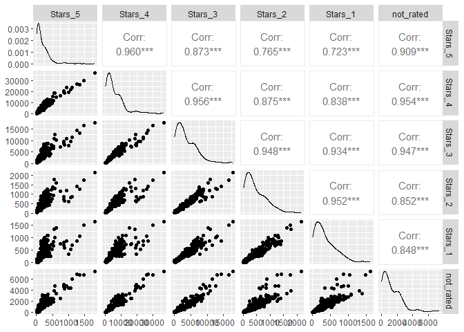

Product ratings
================

Il dataset Product ratings contiene dati su una serie di prodotti nel
catalogo di un noto marketplance online. Per ogni mese e ogni prodotto è
elencato il totale delle review che hanno ottenuto da 5 stelle a 1
stella e tutte le volte che il prodotto è stato acquistato ma non
valutato.

**Analisi delle componenti principali (PCA)**

Lettura e visualizzazione del dataset

``` r
product_data = read.csv("../Datasets/Product_ratings.txt", sep="\t")
head(product_data)
```

    ##   Month   Products Stars_5 Stars_4 Stars_3 Stars_2 Stars_1 not_rated
    ## 1   Jan Product 12     255    5733    3878     351     504      1489
    ## 2   Feb Product 12     277    6613    3816     352     380      1617
    ## 3   Mar Product 12     272    7278    4518     523     475      1949
    ## 4   Apr Product 12     181    5311    3550     383     330      1853
    ## 5   May Product 12     301    5885    3231     396     421      2050
    ## 6   Jun Product 12     259    5436    3115     456     301      2273

Scatterplot con ggally per vedere se ci sono correlazioni ed è quindi
possibile procedere alla riduzione dimensionale

<!-- -->

Sussiste una correlazione tra le variabili =\> ha senso procedere con
l’analisi delle componenti principali

------------------------------------------------------------------------

## PCA Steps

1.  Normalizzazione dei dati
2.  Matrice di covarianza (correlazione per dati standardizzati)
3.  Calcolare le componenti principali (loadings)
4.  Selezione componenti principali
5.  Proiezione dei dati nel nuovo spazio e analisi

------------------------------------------------------------------------

### Step 1

Estraggo solo le variabili numeriche dal dataset e normalizzo i dati

``` r
product_data_num = product_data[,-(1:2)]
head(product_data_num)
```

    ##   Stars_5 Stars_4 Stars_3 Stars_2 Stars_1 not_rated
    ## 1     255    5733    3878     351     504      1489
    ## 2     277    6613    3816     352     380      1617
    ## 3     272    7278    4518     523     475      1949
    ## 4     181    5311    3550     383     330      1853
    ## 5     301    5885    3231     396     421      2050
    ## 6     259    5436    3115     456     301      2273

``` r
product_data_scaled = scale(product_data_num)
head(product_data_scaled)
```

    ##          Stars_5     Stars_4     Stars_3     Stars_2    Stars_1 not_rated
    ## [1,]  0.20868970  0.01397475  0.09114066 -0.29293603  0.5201322 0.1247660
    ## [2,]  0.29424616  0.16848570  0.07093516 -0.29033860  0.1037466 0.2203068
    ## [3,]  0.27480151  0.28524681  0.29971358  0.15382199  0.4227517 0.4681159
    ## [4,] -0.07909111 -0.06012027 -0.01575296 -0.20981826 -0.0641508 0.3964602
    ## [5,]  0.38758048  0.04066301 -0.11971352 -0.17605167  0.2414225 0.5435035
    ## [6,]  0.22424542 -0.03817269 -0.15751736 -0.02020584 -0.1615313 0.7099536

### Step 2
