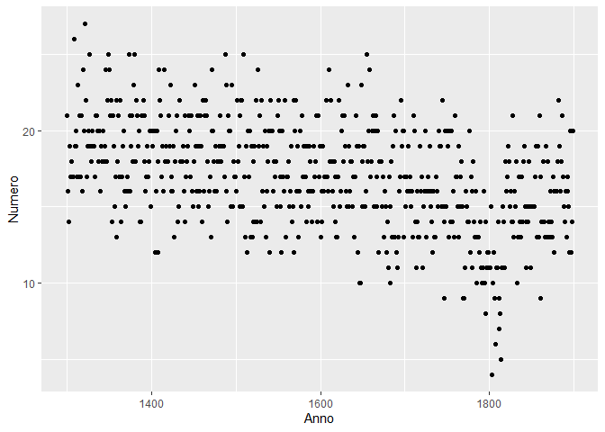
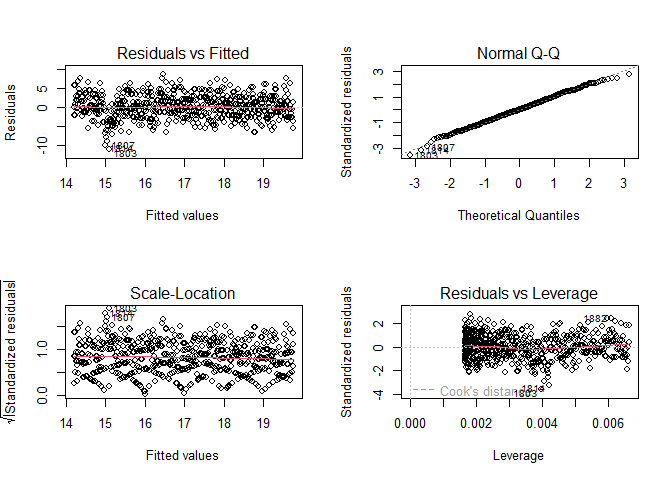
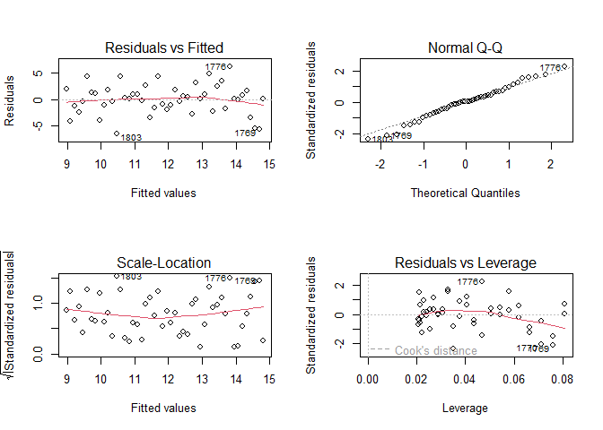
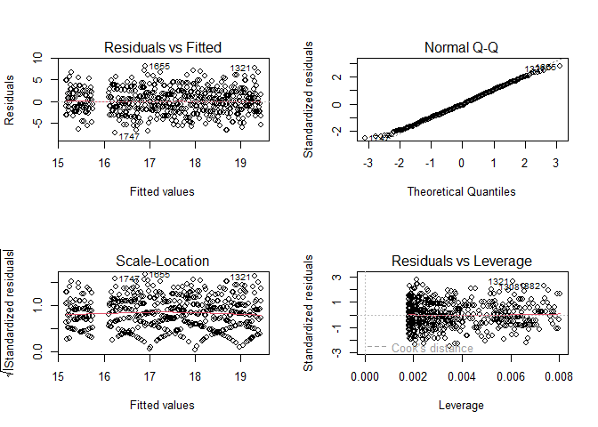
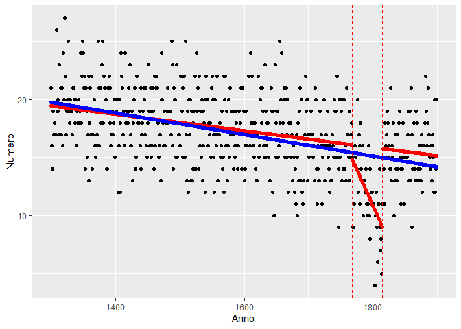

Prohibitorum
================


## Index Librorum Prohibitorum

Index Librorum Prohibitorum, (Latin: “Index of Forbidden Books”) lists
the books once forbidden by [Roman Catholic
Church](https://www.britannica.com/topic/Roman-Catholicism) authority as
dangerous to the faith
or [morals](https://www.britannica.com/topic/morality) of Roman
Catholics. Publication of the list ceased in 1966, and it
was [relegated](https://www.merriam-webster.com/dictionary/relegated) to
the status of a historical document.

The file ‘index.txt’ contains the average of books yearly added from
1300 to 1899. Most of historicians believes that the number has linearly
decreased year by year during that period (model A).

Recently, Prof. Langdon suggested that the linear tendency has changed
during the french egemony from 1768 (Treaty of Versailles) to 1815
(Battle of Waterloo).

Professor assert that during that period the number of books added to
the index has dropped. (Model B)

## Data loading

``` r
data <- read.csv("../Datasets/index.txt", sep=" ")

library(glmnet)
library(ggfortify)
library(ISLR)
library(pls)
```

## Data visualization

``` r
library(ggplot2)
ggplot(data=data, mapping=aes(x=Anno, y=Numero))+
  geom_point()
```

<!-- -->

## Model A

``` r
model_A <- lm(Numero~Anno, data=data)
summary(model_A)
```

    ## 
    ## Call:
    ## lm(formula = Numero ~ Anno, data = data)
    ## 
    ## Residuals:
    ##      Min       1Q   Median       3Q      Max 
    ## -11.0921  -2.1878  -0.0114   2.0792   8.5337 
    ## 
    ## Coefficients:
    ##              Estimate Std. Error t value Pr(>|t|)    
    ## (Intercept) 31.833199   1.184131   26.88   <2e-16 ***
    ## Anno        -0.009285   0.000736  -12.62   <2e-16 ***
    ## ---
    ## Signif. codes:  0 '***' 0.001 '**' 0.01 '*' 0.05 '.' 0.1 ' ' 1
    ## 
    ## Residual standard error: 3.123 on 598 degrees of freedom
    ## Multiple R-squared:  0.2102, Adjusted R-squared:  0.2089 
    ## F-statistic: 159.1 on 1 and 598 DF,  p-value: < 2.2e-16

``` r
alfa = coef(model_A)[1]
beta = coef(model_A)[2]
alfa
```

    ## (Intercept) 
    ##     31.8332

``` r
beta
```

    ##         Anno 
    ## -0.009285109

``` r
par(mfrow = c(2,2))
plot(model_A)
```

<!-- -->

$$
μ(Anno) = \alpha + \beta \cdot Anno
$$

$\alpha$ : 31.8332

$\beta$ : -0.009285109

## Model B

``` r
library(tidyverse)
```

    ## ── Attaching core tidyverse packages ──────────────────────── tidyverse 2.0.0 ──
    ## ✔ dplyr     1.1.0     ✔ readr     2.1.4
    ## ✔ forcats   1.0.0     ✔ stringr   1.5.0
    ## ✔ lubridate 1.9.2     ✔ tibble    3.1.8
    ## ✔ purrr     1.0.1     ✔ tidyr     1.3.0
    ## ── Conflicts ────────────────────────────────────────── tidyverse_conflicts() ──
    ## ✖ tidyr::expand() masks Matrix::expand()
    ## ✖ dplyr::filter() masks stats::filter()
    ## ✖ dplyr::lag()    masks stats::lag()
    ## ✖ tidyr::pack()   masks Matrix::pack()
    ## ✖ tidyr::unpack() masks Matrix::unpack()
    ## ℹ Use the ]8;;http://conflicted.r-lib.org/conflicted package]8;; to force all conflicts to become errors

``` r
data_egemonia_francese <- data %>% filter(Anno<=1815 & Anno>=1768)
model_B <- lm(Numero~Anno, data=data_egemonia_francese)
summary(model_B)
```

    ## 
    ## Call:
    ## lm(formula = Numero ~ Anno, data = data_egemonia_francese)
    ## 
    ## Residuals:
    ##     Min      1Q  Median      3Q     Max 
    ## -6.4671 -1.6133  0.1072  1.7065  6.1784 
    ## 
    ## Coefficients:
    ##              Estimate Std. Error t value Pr(>|t|)    
    ## (Intercept) 234.47201   52.81615   4.439 5.61e-05 ***
    ## Anno         -0.12424    0.02948  -4.214 0.000116 ***
    ## ---
    ## Signif. codes:  0 '***' 0.001 '**' 0.01 '*' 0.05 '.' 0.1 ' ' 1
    ## 
    ## Residual standard error: 2.83 on 46 degrees of freedom
    ## Multiple R-squared:  0.2785, Adjusted R-squared:  0.2629 
    ## F-statistic: 17.76 on 1 and 46 DF,  p-value: 0.0001158

``` r
alfa1 = coef(model_B)[1]
beta1 = coef(model_B)[2]
alfa1
```

    ## (Intercept) 
    ##     234.472

``` r
beta1
```

    ##       Anno 
    ## -0.1242401

``` r
par(mfrow = c(2,2))
plot(model_B)
```

<!-- -->

$$ μ(Anno) = \alpha_1 + \beta_1 \cdot Anno $$

$$
1768 \le Anno \le 1815
$$

$\alpha_1$ : 234.472

$\beta_1$ : -0.1242401

``` r
data_senza_egemonia_francese <- data %>% filter(Anno>1815 | Anno<1768)
model_B_2 <- lm(Numero~Anno, data=data_senza_egemonia_francese)
summary(model_B_2)
```

    ## 
    ## Call:
    ## lm(formula = Numero ~ Anno, data = data_senza_egemonia_francese)
    ## 
    ## Residuals:
    ##     Min      1Q  Median      3Q     Max 
    ## -7.2483 -2.1111 -0.1994  2.0817  8.0930 
    ## 
    ## Coefficients:
    ##               Estimate Std. Error t value Pr(>|t|)    
    ## (Intercept) 28.7565598  1.1608881  24.771   <2e-16 ***
    ## Anno        -0.0071599  0.0007292  -9.819   <2e-16 ***
    ## ---
    ## Signif. codes:  0 '***' 0.001 '**' 0.01 '*' 0.05 '.' 0.1 ' ' 1
    ## 
    ## Residual standard error: 2.923 on 550 degrees of freedom
    ## Multiple R-squared:  0.1491, Adjusted R-squared:  0.1476 
    ## F-statistic:  96.4 on 1 and 550 DF,  p-value: < 2.2e-16

``` r
alfa2 = coef(model_B_2)[1]
beta2 = coef(model_B_2)[2]
alfa2
```

    ## (Intercept) 
    ##    28.75656

``` r
beta2
```

    ##         Anno 
    ## -0.007159853

``` r
par(mfrow = c(2,2))
plot(model_B_2)
```

<!-- -->

$$ μ(Anno) = \alpha_2 + \beta_2 \cdot Anno $$

$$ Anno < 1768 \ \ or \ \ Anno>1815 $$

$\alpha_2$ : 28.75656

$\beta_2$ : -0.007159853

## Model visualization

``` r
data$y_hat_modelA = predict(model_A, newdata = data.frame(Anno=data$Anno))
y_hat_modelB = predict(model_B, newdata = data.frame(Anno=data$Anno))
y_hat_modelB2 = predict(model_B_2, newdata = data.frame(Anno=data$Anno))
data$y_hat_modelB = c(y_hat_modelB2[data$Anno<1768], y_hat_modelB[data$Anno>=1768 & data$Anno<=1815], y_hat_modelB2[data$Anno>1815])

ggplot(data=data, mapping = aes(x=Anno, y=Numero))+
  geom_point()+
  geom_point(mapping=aes(x=Anno, y=y_hat_modelB), color="red")+
  geom_point(mapping=aes(x=Anno,y=y_hat_modelA),color="blue")+
  geom_vline(xintercept=1768, color="red", linetype="dashed")+
  geom_vline(xintercept=1815, color="red", linetype="dashed")
```

<!-- -->

## Conclusion

Both model A and B respect the OLS model’s assumptions:

- Residuals are normally distributed (see Q-Q Plot and shapiro test)

- Homoscedasticity (see Residuals vs Fitted chart: all points are
  elliptically distributed along the residuals=0 axis)

Model B has higher $R^2$ index and all the parameters are statistically
significative.

We can give reason to Professor Langdon’s theory.
