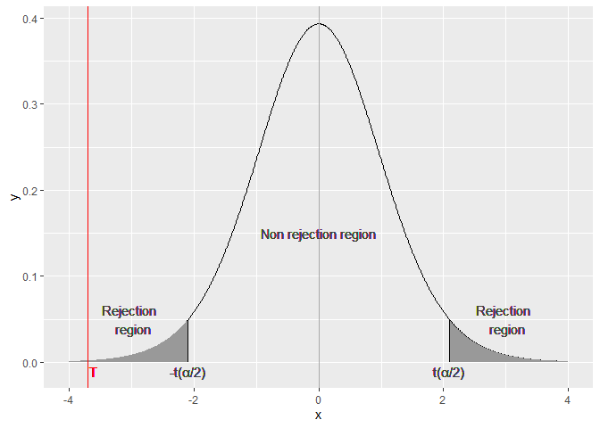

Two-sample pooled t-test (equal variances) for a cafe in Milan
================

## Table of contents

1.  [Data](#data)
2.  [Question](#question)
3.  [Hypotesis](#hypotesis)
4.  [Setting up the test](#setting-up-the-test) <br> 4.1. [Pooled
    variance](#pooled-variance) <br> 4.2. [Test
    statistic](#test-statistic) <br> 4.3. [Plotting the
    Test](#plotting-the-test) <br> 4.4. [P-Value](#p-value)

### Data

Revenues from a well known cafe in Milan were collected ten days before
14/6/2021 (DD:MM:YYYY) and ten days after. 14/6/2021 was the day when
covid’s lockdown ended in Italy.

|                      | Average measured revenue | Measured variance |
|----------------------|--------------------------|-------------------|
| **Before 14/6/2021** | 6616                     | 1881671           |
| **After 14/6/2021**  | 8384                     | 395448,9          |

``` r
#Data setup

n_1=10 # dimension of the 1st sample
n_2=10 # dimension of the 2nd sample

s_mean_1=6616 # sample mean 1
s_mean_2=8384 # sample mean 2

s_var_1=1881671 # sample variance 1
s_var_2=395448.9 # sample variance 2
```

### Question

Determine if there was a significative variation in the revenues after
the lockdown has been teared down.

### Hypotesis

Populations:

- follow a Gaussian distribution

  $$
  Y_{11}....Y_{1n_1}\sim^{iid} N(\mu_1, \sigma_1^2)\\
  $$

  $$
  Y_{21}....Y_{2n_2}\sim^{iid} N(\mu_2, \sigma_2^2)
  $$

- have the same variance (homoscedasticity)

  $$
  \sigma_1^2=\sigma_2^2=\sigma^2
  $$

- are independent to each other

## Setting up the test

We can translate the question into mathematical language by considering
the null hypothesis

$$
H_0:\mu_1=\mu_2
$$

Versus the alternative

$$
H_1:\mu_1\ne\mu_2
$$

From theory, the sample means follow a Gaussian distribution with
parameters given by the population mean and sample variance over sample
dimension.

$$
\bar Y_1\sim N\Big(\mu, \frac{s_1^2}{n_1}\Big)
$$

$$
\bar Y_2\sim N\Big(\mu, \frac{s_2^2}{n_2}\Big)
$$

In order to know if the means changed, we will consider the difference
between the sample means

$$
\bar Y_1-\bar Y_2\sim N(\mu_1-\mu_2,\sigma^2\Big(\frac{1}{n_1}+\frac{1}{n_2}\Big))
$$

Normalizing,

$$
\frac{\bar Y_1-\bar Y_2-(\mu_1-\mu_2)}{\sqrt{
\sigma^2\Big(\frac{1}{n_1}+\frac{1}{n_2}\Big)
}}\sim N(0,1)
$$

``` r
s_mean_diff = s_mean_1 - s_mean_2
s_mean_diff
```

    ## [1] -1768

### Pooled variance

To estimate the populations variance $\sigma^2$ we introduce the pooled
variance:

$$
s_{pooled}^2=\frac{(n_1-1)s_1^2+(n_2-1)s_2^2}{n_1+n_2-2}\approx\sigma^2
$$

``` r
s2_pooled = ((n_1-1)*s_var_1+(n_2-1)*s_var_2)/(n_1+n_2-2)
s2_pooled
```

    ## [1] 1138560

### Test statistic

$$
T=\frac{\bar Y_1-\bar Y_2-(\mu_1-\mu_2)}{\sqrt{s_p^2\Big(\frac{1}{n_1}+\frac{1}{n_2}\Big)}}\sim t(n_1+n_2-2)
$$

Assuming $H_0:\mu_1=\mu_2$,

$$
T=\frac{\bar Y_1-\bar Y_2}{\sqrt{s_p^2\Big(\frac{1}{n_1}+\frac{1}{n_2}\Big)}}
$$

``` r
t = (s_mean_diff)/sqrt(s2_pooled*(1/n_1 + 1/n_2))
t
```

    ## [1] -3.705009

From t-quartiles definition, the probability of T to stand inside the
$\frac{\alpha}{2}$ quantiles is $1-\alpha$ where $\alpha$ represents the
level of significance for the test.

$$
P\Big(-t_{\frac{\alpha}{2} ,n_1+n_2-2}\le 
T
\le t_{\frac{\alpha}{2} ,n_1+n_2-2}\Big)=1-\alpha
$$

By setting the level of significance $\alpha = 0.05$, under $H_0$, the
above equation will tell us that at 95% probability, T will stay between
the quantiles:

``` r
alpha = 0.05
dof=n_1+n_2-2 #degrees of freedom of the t-student distribution
lower_quantile = qt(alpha/2,df=dof)
upper_quantile = -qt(alpha/2,df=dof)
c(lower_quantile,upper_quantile)
```

    ## [1] -2.100922  2.100922

### Plotting the Test

``` r
# Plot the t-distribution with n1+n2-2 degrees of freedom, the t-quantiles and the test statistic using GGPlot
library(GGally)

t_distrib = data.frame(x=seq(-4,4,by=0.01), y=dt(seq(-4,4,by=0.01), df=dof))
ggplot(data = t_distrib) + 
  geom_line(aes(x=x,y=y)) + 
  geom_segment(aes(x=lower_quantile,y=0,xend=lower_quantile,yend=dt(lower_quantile,dof))) + 
  geom_polygon(data = rbind(c(lower_quantile,0), subset(t_distrib, x < lower_quantile)), aes(x, y), fill="#999999")+
  geom_segment(aes(x=upper_quantile,y=0,xend=upper_quantile,yend=dt(upper_quantile,dof))) + 
  geom_polygon(data = rbind(c(upper_quantile,0),subset(t_distrib, x > upper_quantile)
  ), aes(x, y ), fill="#999999")+
  geom_vline(xintercept=t, color="red")+
  geom_text(label="T",aes(x= t+0.1, y = -0.01), color="red")+
  geom_text(label="Non rejection region",aes(x= 0, y = 0.15), color="#444444")+
  geom_text(label="Rejection \n region",aes(x= -3, y = 0.05), color="#444444")+
  geom_text(label="Rejection \n region",aes(x= 3, y = 0.05), color="#444444")+
  geom_text(label="-t(α/2)",aes(x= lower_quantile, y = -0.01), color="#444444")+
  geom_text(label="t(α/2)",aes(x= upper_quantile, y = -0.01), color="#444444")
```

<!-- -->

As we can see, the test statistic T $(-3.705009)$ is out of the range
$[-2.100922 , 2.100922]$

Therefore, we reject the null hypotesis $H_0$ and accept
$H_1:\mu_1\ne\mu_2$ (revenue means have changed after lockdown’s
removal) with a $1-\alpha=95\%$ level of confidence.

### P-Value

P-Value allow us to know what’s the minimum level of significance for
which the test will reject $H_0$.

$$
T=
t_{\frac{\alpha}{2} ,n_1+n_2-2}
$$

$$
P(T)=
\frac{\alpha}{2}
$$

$$
\alpha = 2\cdot P(T)
$$

``` r
p_value = 2*(pt(t, df=dof))
p_value
```

    ## [1] 0.001620479

The P-Value is very low, so we can safely reject $H_0$
